# 📘 Documentation technique – Forms référentielles - Phases 1 & 2

[TOC]

## 0. Checklist – Créer un nouveau référentiel

1. Créer la classe métier `Xxx` dans `Classes/Referentiels`
2. Ajouter les requêtes SQL `Xxx_*` dans `QueryModule`
3. Ajouter les méthodes CRUD `Xxx_*` dans `GestionReferentiel`
4. Créer la Form `GestionXxx` avec structure standard (`pnlTop`, `tlpMain`, `pnlActions`, `stsStatus`)
5. Implémenter modes `Consultation / Nouveau / Modification`
6. Implémenter `SelectionChanged` + `BindSelectedToDetails()`
7. Implémenter validation locale (`errProvider`) + statut global (`StatusStrip`)
8. Mettre à jour `Rules.md`, `Process_Artefact.md` et `CHANGELOG.md`

------

## 1. Objectif

Ce document décrit la structure technique et fonctionnelle des forms référentielles d’Artefact.

Il permet de comprendre :

- le rôle de chaque form
- les tables concernées
- les classes métier associées
- les modules impliqués
- les dépendances
- les contrôles UI et leur lien avec la base

------

## 2. Architecture commune

### 2.1 Séparation des responsabilités

```
Form UI
   ↓
GestionReferentiel
   ↓
QueryModule
   ↓
DatabaseManager
   ↓
MariaDB
```

### 2.2 Modules transverses

| Élément               | Rôle                  |
| --------------------- | --------------------- |
| `DatabaseManager`     | Connexion MariaDB     |
| `GestionReferentiel`  | CRUD + logique métier |
| `QueryModule`         | Requêtes SQL          |
| `GestionLog`          | Logging               |
| `UtilsForm`           | Helpers UI            |
| `RichTextNotesHelper` | Notes enrichies       |

------

## 3. Contrôles communs

### 3.1 Modèle de base

| Contrôle         | Rôle                |
| ---------------- | ------------------- |
| `lblTitreForm`   | Titre               |
| `stsStatus`      | Barre de statut     |
| `stsLabelStatus` | Message             |
| `pnlForm`        | Conteneur principal |

------

### 3.2 Structure référentielle

| Contrôle         | Rôle                |
| ---------------- | ------------------- |
| `pnlTop`         | Recherche / filtres |
| `pnlActions`     | Boutons             |
| `tlpMain`        | Layout principal    |
| `dgv...`         | Liste               |
| `txtSearch`      | Recherche           |
| `btnSearch`      | Lancer recherche    |
| `btnClearSearch` | Reset               |

------

### 3.3 Boutons standard

| Bouton      | Rôle        |
| ----------- | ----------- |
| `btnNew`    | Nouveau     |
| `btnEdit`   | Modifier    |
| `btnSave`   | Enregistrer |
| `btnCancel` | Annuler     |
| `btnDelete` | Supprimer   |
| `btnClose`  | Fermer      |

------

### 3.4 Règles DataGridView

- `FormatReferentielGrid(dgv)`
- `HighlightMainColumn(dgv)`
- sélection via `CurrentRow`

------

### 3.5 Notes enrichies

- stockage : `_rtf` + `_txt`
- recherche : uniquement `_txt`
- gestion obligatoire via `RichTextNotesHelper`

------

## 4. Forms

------

# 4.1 GestionLangues

## Tables

- `langues`

## Classe

###### `Langue`

- Public Property IdLangue As ULong
- Public Property NomLangue As String
- Public Property AbrevLangue As String
- Public Property Iso639_1 As String
- Public Property Iso639_2 As String
- Public Property CodeLangue As String

## Contrôles

| Contrôle         | Champ DB       |
| ---------------- | -------------- |
| `dgvLangues`     | -              |
| `txtIdLangue`    | `id_langue`    |
| `txtCodeLangue`  | `code_langue`  |
| `txtNomLangue`   | `nom_langue`   |
| `txtAbrevLangue` | `abrev_langue` |
| `txtIso639_1`    | `iso639_1`     |
| `txtIso639_2`    | `iso639_2`     |

## GestionReferentiel

| Méthode                     | Rôle                |
| --------------------------- | ------------------- |
| `Langue_GetAll()`           | chargement liste    |
| `Langue_GetBySearch()`      | recherche           |
| `Langue_Insert()`           | insertion           |
| `Langue_Update()`           | modification        |
| `Langue_Delete()`           | suppression         |
| `Langue_CountDependances()` | vérification usages |

## QueryModule

| Requête                   | Rôle           |
| ------------------------- | -------------- |
| `Langue_SelectAll`        | liste complète |
| `Langue_SelectBySearch`   | recherche      |
| `Langue_Insert`           | insertion      |
| `Langue_Update`           | modification   |
| `Langue_Delete`           | suppression    |
| `Langue_CountDependances` | dépendances    |

###### GestionLangues

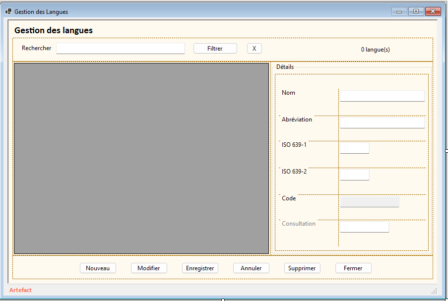

# 4.2 GestionPays

## Tables

- `pays`

## Classe

###### `Pays`

-   Public Property IdPays As ULong
-   Public Property NomPays As String
-   Public Property Iso2 As String
-   Public Property Iso3 As String
-   Public Property CodePays As String

## Contrôles

| Contrôle      | Champ DB    |
| ------------- | ----------- |
| `dgvPays`     | -           |
| `txtIdPays`   | `id_pays`   |
| `txtCodePays` | `code_pays` |
| `txtNomPays`  | `nom_pays`  |
| `txtIso2`     | `iso2`      |
| `txtIso3`     | `iso3`      |

## GestionReferentiel

| Méthode                   | Rôle         |
| ------------------------- | ------------ |
| `Pays_GetAll()`           | chargement   |
| `Pays_GetBySearch()`      | recherche    |
| `Pays_Insert()`           | insertion    |
| `Pays_Update()`           | modification |
| `Pays_Delete()`           | suppression  |
| `Pays_CountDependances()` | contrôle     |

## QueryModule

| Requête                 | Rôle      |
| ----------------------- | --------- |
| `Pays_SelectAll`        | liste     |
| `Pays_SelectBySearch`   | recherche |
| `Pays_Insert`           | insertion |
| `Pays_Update`           | update    |
| `Pays_Delete`           | delete    |
| `Pays_CountDependances` | usages    |

###### GestionPays

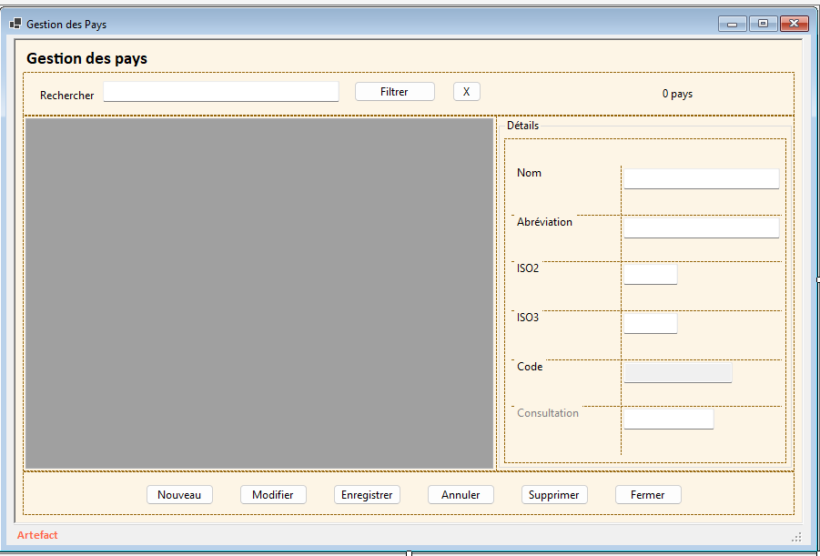

# 4.3 GestionRefEnum

## Tables

- `ref_enum_type`
- `ref_enum`

## Classes

###### `RefEnumType`

-  Public Property IdEnum As ULong
- Public Property CodeEnum As String            ' Code généré (ex: E000123) selon ton préfixe
- Public Property IdEnumType As ULong        ' FK vers ref_enum_type
- Public Property CodeValeur As String          ' Clé technique (MAJUSCULE) ex: ACHAT
- Public Property LibelleValeur As String        ' Libellé humain ex: Achat
-  Public Property OrdreAffichage As Integer
-  Public Property IsActif As Boolean

###### `RefEnumValeur`

- ​    Public Property IdEnumType As ULong
- ​    Public Property CodeEnumType As String     ' Code généré (ex: ET000001)
- ​    Public Property CodeType As String               ' Clé technique (MAJUSCULE) ex: TYPE_ACQUISITION
- ​    Public Property LibelleType As String             ' Libellé humain
- ​    Public Property OrdreAffichage As Integer
- ​    Public Property IsActif As Boolean

## Contrôles

| Contrôle                  | Champ DB          |
| ------------------------- | ----------------- |
| `dgvRefEnumTypes`         | -                 |
| `dgvRefEnumValeurs`       | -                 |
| `txtIdEnumType`           | `id_enum_type`    |
| `txtCodeEnumType`         | `code_enum_type`  |
| `txtCodeType`             | `code_type`       |
| `txtLibelleType`          | `libelle_type`    |
| `nudOrdreAffichageType`   | `ordre_affichage` |
| `chkEnumTypeActif`        | `is_actif`        |
| `txtIdEnum`               | `id_enum`         |
| `txtCodeEnum`             | `code_enum`       |
| `cboEnumTypeParent`       | `id_enum_type`    |
| `txtCodeValeur`           | `code_valeur`     |
| `txtLibelleValeur`        | `libelle_valeur`  |
| `nudOrdreAffichageValeur` | `ordre_affichage` |
| `chkEnumValeurActive`     | `is_actif`        |

## GestionReferentiel

| Méthode                      | Rôle             |
| ---------------------------- | ---------------- |
| `RefEnumType_GetAll()`       | types            |
| `RefEnumType_Insert()`       | insert type      |
| `RefEnumType_Update()`       | update type      |
| `RefEnumType_Delete()`       | delete type      |
| `RefEnum_GetByType()`        | valeurs par type |
| `RefEnum_Insert()`           | insert valeur    |
| `RefEnum_Update()`           | update valeur    |
| `RefEnum_Delete()`           | delete valeur    |
| `RefEnum_CountDependances()` | usages           |

## QueryModule

| Requête                    | Rôle    |
| -------------------------- | ------- |
| `RefEnumType_SelectAll`    | types   |
| `RefEnumType_Insert`       | insert  |
| `RefEnumType_Update`       | update  |
| `RefEnumType_Delete`       | delete  |
| `RefEnum_SelectByType`     | valeurs |
| `RefEnum_Insert`           | insert  |
| `RefEnum_Update`           | update  |
| `RefEnum_Delete`           | delete  |
| `RefEnum_CountDependances` | usages  |

###### GestionRefEnum - Tab Types Enum

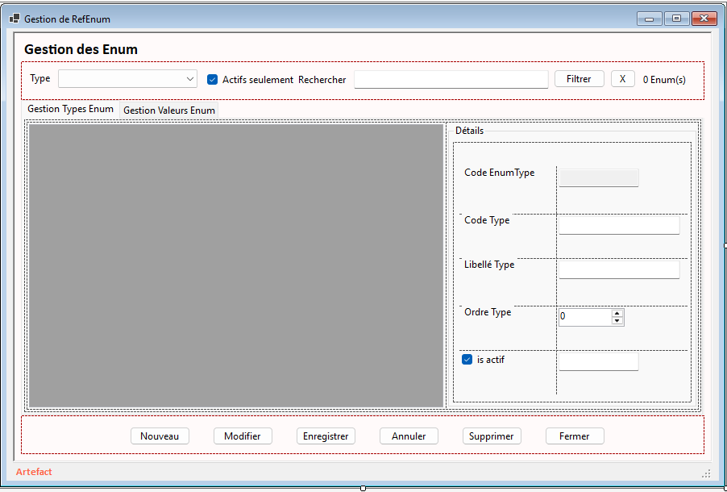

###### GestionRefEnum - Tab Valeurs Enum

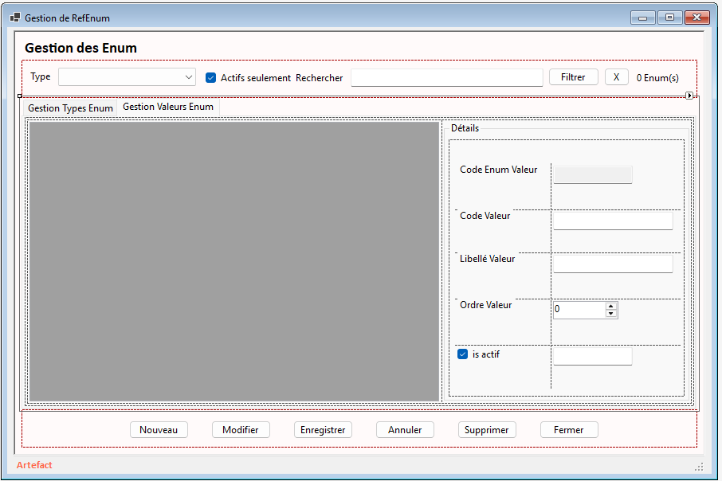

# 4.4 GestionContacts

## Tables

- `contacts`

## Classe

###### `Contact`

- ​    Public Property IdContact As ULong

- ​    Public Property CodeContact As String

- ​    Public Property NomContact As String

- ​    Public Property EmailPerso As String

- ​    Public Property AdresseLiseuse As String

- ​    Public Property TypeLiseuse As String

## Contrôles

| Contrôle            | Champ DB          |
| ------------------- | ----------------- |
| `dgvContacts`       | -                 |
| `txtIdContact`      | `id_contact`      |
| `txtCodeContact`    | `code_contact`    |
| `txtNomContact`     | `nom_contact`     |
| `txtEmailPerso`     | `email_perso`     |
| `txtAdresseLiseuse` | `adresse_liseuse` |
| `txtTypeLiseuse`    | `type_liseuse`    |

## GestionReferentiel

| Méthode                 | Rôle        |
| ----------------------- | ----------- |
| `Contact_GetAll()`      | chargement  |
| `Contact_GetBySearch()` | recherche   |
| `Contact_Insert()`      | insert      |
| `Contact_Update()`      | update      |
| `Contact_Delete()`      | delete      |
| `Contact_CountLivres()` | dépendances |

## QueryModule

| Requête                  | Rôle      |
| ------------------------ | --------- |
| `Contact_SelectAll`      | liste     |
| `Contact_SelectBySearch` | recherche |
| `Contact_Insert`         | insert    |
| `Contact_Update`         | update    |
| `Contact_Delete`         | delete    |
| `Contact_CountLivres`    | usages    |

###### GestionContacts.png

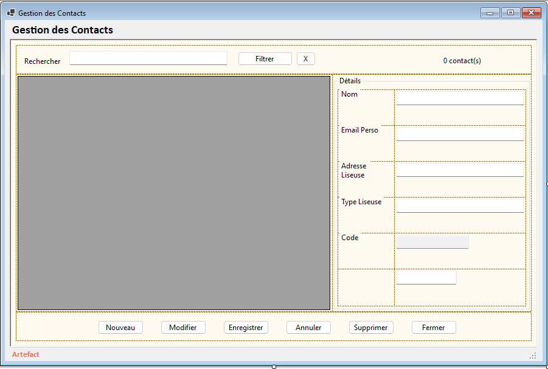

# 4.5 GestionEditeurs

## Tables

- `editeurs`
- `pays`

## Classe

###### `Editeur`

-  Public Property IdEditeur As ULong

-  Public Property CodeEditeur As String

-  Public Property NomEditeur As String

-  Public Property IdPays As ULong?

-  Public Property SiteWeb As String

-  Public Property NotesEditeurRtf As String
- Public Property NotesEditeurTxt As String

## Contrôles

| Contrôle          | Champ DB                  |
| ----------------- | ------------------------- |
| `dgvEditeurs`     | -                         |
| `txtIdEditeur`    | `id_editeur`              |
| `txtCodeEditeur`  | `code_editeur`            |
| `txtNomEditeur`   | `nom_editeur`             |
| `cboPaysEditeur`  | `id_pays`                 |
| `txtSiteWeb`      | `site_web`                |
| `rtbNotesEditeur` | `notes_editeur_rtf / txt` |
| `chkSearchNotes`  | -                         |

## GestionReferentiel

| Méthode                 | Rôle       |
| ----------------------- | ---------- |
| `Editeur_GetAll()`      | chargement |
| `Editeur_GetBySearch()` | recherche  |
| `Editeur_Insert()`      | insert     |
| `Editeur_Update()`      | update     |
| `Editeur_Delete()`      | delete     |
| `Editeur_CountLivres()` | usages     |

## QueryModule

| Requête                  | Rôle      |
| ------------------------ | --------- |
| `Editeur_SelectAll`      | liste     |
| `Editeur_SelectBySearch` | recherche |
| `Editeur_Insert`         | insert    |
| `Editeur_Update`         | update    |
| `Editeur_Delete`         | delete    |
| `Editeur_CountLivres`    | usages    |

###### GestionEditeurs

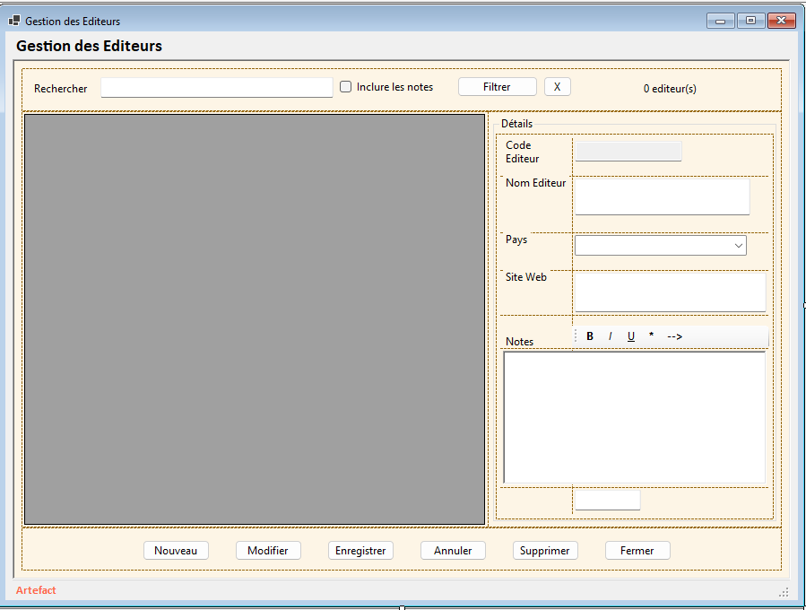

# 4.6 GestionFormatFile

## Tables

- `formatFile`

## Classe

###### `FormatFile`

-  Public Property IdFormatFile As ULong

-  Public Property CodeFormatFile As String

-  Public Property NomFormat As String

-  Public Property Extension As String

-  Public Property MimeType As String

-  Public Property OrdreAffichage As Integer

-  Public Property IsActif As Boolean

## Contrôles

| Contrôle             | Champ DB          |
| -------------------- | ----------------- |
| `dgvFormatFile`      | -                 |
| `txtIdFormatFile`    | `id_formatFile`   |
| `txtCodeFormatFile`  | `code_formatFile` |
| `txtNomFormat`       | `nom_format`      |
| `txtExtension`       | `extension`       |
| `txtMimeType`        | `mime_type`       |
| `nudOrdreAffichage`  | `ordre_affichage` |
| `chkFormatFileActif` | `is_actif`        |

## GestionReferentiel

| Méthode                            | Rôle       |
| ---------------------------------- | ---------- |
| `FormatFile_GetAll()`              | chargement |
| `FormatFile_GetBySearch()`         | recherche  |
| `FormatFile_Insert()`              | insert     |
| `FormatFile_Update()`              | update     |
| `FormatFile_Delete()`              | delete     |
| `FormatFile_CountLivresFichiers()` | usages     |

## QueryModule

| Requête                          | Rôle      |
| -------------------------------- | --------- |
| `FormatFile_SelectAll`           | liste     |
| `FormatFile_SelectBySearch`      | recherche |
| `FormatFile_Insert`              | insert    |
| `FormatFile_Update`              | update    |
| `FormatFile_Delete`              | delete    |
| `FormatFile_CountLivresFichiers` | usages    |

###### GestionFormatFile

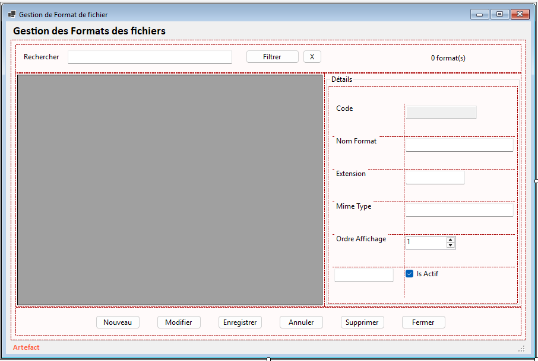

# 4.7 GestionImpression

## Tables

- `impression`

## Classe

###### `Impression`

-   Public Property IdImpression As ULong

-   Public Property CodeImpression As String

-   Public Property NomImpression As String

-   Public Property DescriptionImpression As String

-   Public Property NoteRtf As String
-   Public Property NoteTxt As String
-   Public Property EnvieCal As String

-   Public Property IsActif As Boolean

## Contrôles

| Contrôle                   | Champ DB                 |
| -------------------------- | ------------------------ |
| `dgvImpression`            | -                        |
| `txtIdImpression`          | `id_impression`          |
| `txtCodeImpression`        | `code_impression`        |
| `txtNomImpression`         | `nom_impression`         |
| `txtDescriptionImpression` | `description_impression` |
| `rtbNoteImpression`        | `note_rtf / txt`         |
| `txtEnvieCal`              | `envie_Cal`              |
| `chkImpressionActive`      | `is_actif`               |
| `chkSearchNotes`           | -                        |

## GestionReferentiel

| Méthode                    | Rôle       |
| -------------------------- | ---------- |
| `Impression_GetAll()`      | chargement |
| `Impression_GetBySearch()` | recherche  |
| `Impression_Insert()`      | insert     |
| `Impression_Update()`      | update     |
| `Impression_Delete()`      | delete     |
| `Impression_CountLivres()` | usages     |

## QueryModule

| Requête                     | Rôle      |
| --------------------------- | --------- |
| `Impression_SelectAll`      | liste     |
| `Impression_SelectBySearch` | recherche |
| `Impression_Insert`         | insert    |
| `Impression_Update`         | update    |
| `Impression_Delete`         | delete    |
| `Impression_CountLivres`    | usages    |

###### GestionImpression

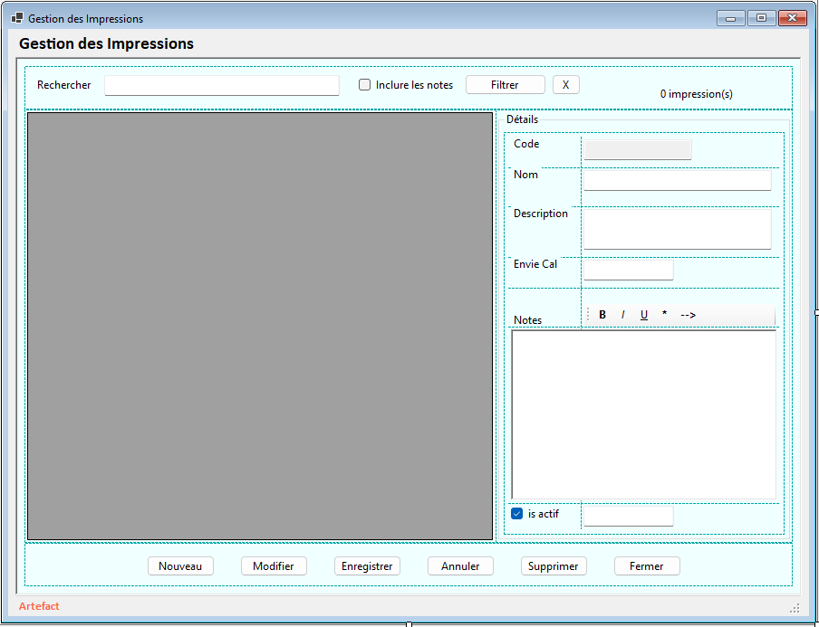

# 4.8 GestionRecommandations

## Tables

- `ref_origine_recommandation`
- `recommandations`
- `livres_recommandations`
- `livres_staging_recommandations`

## Classes

`RefOrigineRecommandation`

- ​    Public Property IdOrigineRecommandation As ULong
- ​    Public Property CodeOrigineRecommandation As String = String.Empty
- ​    Public Property LibelleOrigineRecommandation As String = String.Empty
- ​    Public Property OrdreAffichage As Integer
- ​    Public Property IsActif As Boolean = True

###### `Recommandation`

- ​    Public Property IdRecommandation As ULong
- ​    Public Property CodeRecommandation As String = String.Empty
- ​    Public Property IdOrigineRecommandation As ULong
- ​    Public Property SourceNom As String = String.Empty
- ​    Public Property SourceLogin As String = String.Empty
- ​    Public Property SourceURL As String = String.Empty
- ​    Public Property DateRecommandation As Date?
- ​    Public Property CommentaireRtf As String
- ​    Public Property CommentaireTxt As String
- ​    Public Property IsActif As Boolean = True

## Contrôles

| Contrôle                          | Champ DB                         |
| --------------------------------- | -------------------------------- |
| `dgvOriginesRecommandation`       | -                                |
| `dgvRecommandations`              | -                                |
| `txtIdOrigineRecommandation`      | `id_origine_recommandation`      |
| `txtCodeOrigineRecommandation`    | `code_origine_recommandation`    |
| `txtLibelleOrigineRecommandation` | `libelle_origine_recommandation` |
| `nudOrdreAffichageOrigine`        | `ordre_affichage`                |
| `chkOrigineRecommandationActive`  | `is_actif`                       |
| `txtIdRecommandation`             | `id_recommandation`              |
| `txtCodeRecommandation`           | `code_recommandation`            |
| `cboOrigineRecommandation`        | `id_origine_recommandation`      |
| `cboFiltreOrigineRecommandation`  | -                                |
| `txtSourceNom`                    | `source_nom`                     |
| `txtSourceLogin`                  | `source_login`                   |
| `txtSourceUrl`                    | `source_url`                     |
| `dtpDateRecommandation`           | `date_recommandation`            |
| `rtbCommentaireRecommandation`    | `commentaire_rtf / txt`          |
| `chkRecommandationActive`         | `is_actif`                       |
| `chkSearchNotes`                  | -                                |
| `chkActifsOnly`                   | -                                |

## GestionReferentiel

| Méthode                          | Rôle           |
| -------------------------------- | -------------- |
| `OrigineRecommandation_GetAll()` | origines       |
| `OrigineRecommandation_Insert()` | insert origine |
| `OrigineRecommandation_Update()` | update origine |
| `OrigineRecommandation_Delete()` | delete origine |
| `Recommandation_GetAll()`        | liste          |
| `Recommandation_GetBySearch()`   | recherche      |
| `Recommandation_GetByOrigine()`  | filtre         |
| `Recommandation_Insert()`        | insert         |
| `Recommandation_Update()`        | update         |
| `Recommandation_Delete()`        | delete         |
| `Recommandation_CountUsages()`   | usages         |

## QueryModule

| Requête                           | Rôle      |
| --------------------------------- | --------- |
| `OrigineRecommandation_SelectAll` | origines  |
| `OrigineRecommandation_Insert`    | insert    |
| `OrigineRecommandation_Update`    | update    |
| `OrigineRecommandation_Delete`    | delete    |
| `Recommandation_SelectAll`        | liste     |
| `Recommandation_SelectBySearch`   | recherche |
| `Recommandation_SelectByOrigine`  | filtre    |
| `Recommandation_Insert`           | insert    |
| `Recommandation_Update`           | update    |
| `Recommandation_Delete`           | delete    |
| `Recommandation_CountUsages`      | usages    |

###### GestionRecommandations - Tab Origines

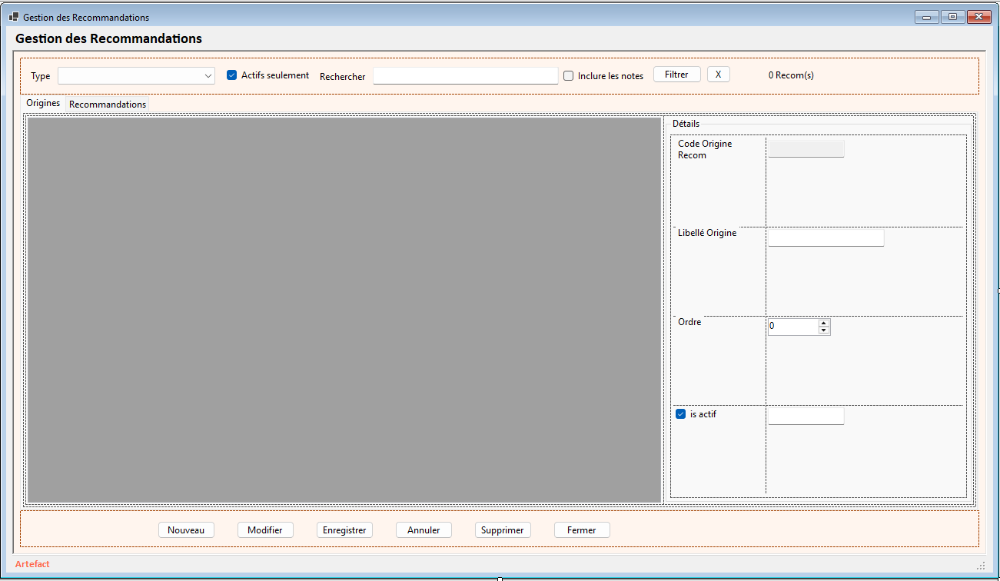

###### GestionRecommandations - Tab Recommandations

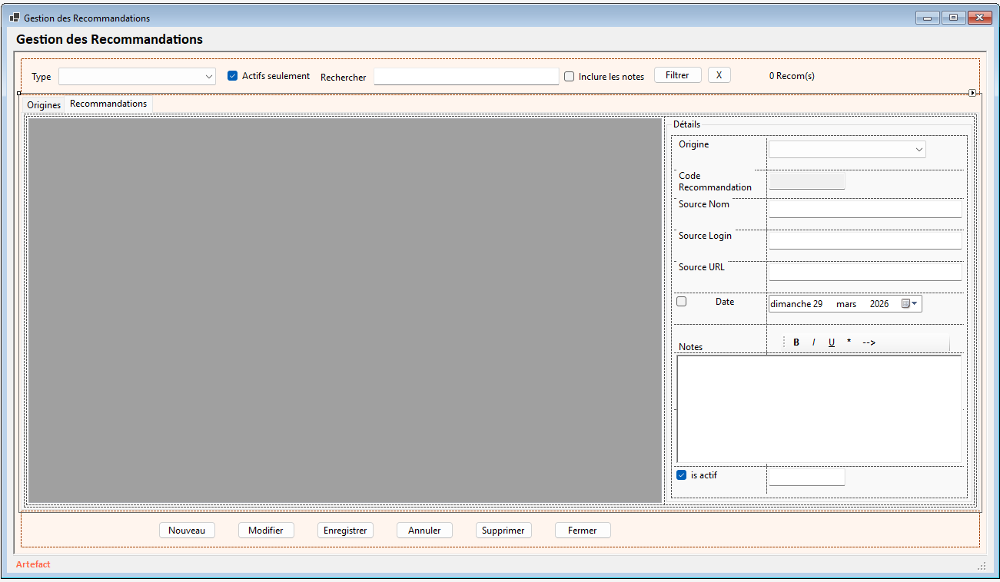

# 4.9 GestionPrixLit

## Tables

- `prixlit`
- `prixlit_categorie`
- `prixlit_annee`
- `livres_prixlit_annee`

## Classes

`PrixLit`

- Public Property IdPrixLit As ULong
- Public Property NomPrixLit As String = String.Empty
- Public Property DescriptionPrixLit As String = String.Empty
- Public Property NotesPrixLitTxt As String = String.Empty
- Public Property NotesPrixLitRtf As String = String.Empty
- Public Property IsActif As Boolean = True

- Public Property CreatedAt As DateTime
- Public Property UpdatedAt As DateTime
- Public Property CodePrixLit As String = String.Empty

`PrixLitCategorie`

- Public Property IdPrixLitCategorie As ULong
- Public Property IdPrixLit As ULong
- Public Property LibelleCategorie As String = String.Empty
- Public Property DescriptionCategorie As String = String.Empty
- Public Property OrdreAffichage As Integer = 0
- Public Property IsActif As Boolean = True
- Public Property CreatedAt As DateTime
- Public Property UpdatedAt As DateTime
- Public Property CodePrixLitCategorie As String = String.Empty

###### `PrixLitAnnee`

-  Public Property IdPrixLitAnnee As ULong
- Public Property IdPrixLitCategorie As ULong
- Public Property Annee As Integer

- Public Property CreatedAt As DateTime
- Public Property UpdatedAt As DateTime
- Public Property CodePrixLitAnnee As String = String.Empty

## Contrôles

| Contrôle                       | Champ DB                 |
| ------------------------------ | ------------------------ |
| `dgvPrixLit`                   | -                        |
| `txtIdPrixLit`                 | `id_prixLit`             |
| `txtCodePrixLit`               | `code_prixLit`           |
| `txtNomPrixLit`                | `nom_prixLit`            |
| `txtDescriptionPrixLit`        | `description_prixLit`    |
| `rtbNotesPrixLit`              | `Notes_rtf / txt`        |
| `chkPrixLitActif`              | `is_actif`               |
| `chkRechercheDansNotesPrixLit` | -                        |
| `dgvPrixLitCategorie`          | -                        |
| `txtIdPrixLitCategorie`        | `id_prixlit_categorie`   |
| `txtCodePrixLitCategorie`      | `code_prixlit_categorie` |
| `cboPrixLitParentCategorie`    | `id_prixLit`             |
| `txtLibelleCategorie`          | `libelle_categorie`      |
| `txtDescriptionCategorie`      | `description_categorie`  |
| `nudOrdreAffichageCategorie`   | `ordre_affichage`        |
| `chkPrixLitCategorieActif`     | `is_actif`               |
| `dgvPrixLitAnnee`              | -                        |
| `txtIdPrixLitAnnee`            | `id_prixLit_Annee`       |
| `txtCodePrixLitAnnee`          | `code_prixLit_Annee`     |
| `cboPrixLitCategorieAnnee`     | `id_prixlit_categorie`   |
| `nudAnneePrixLit`              | `annee`                  |
| `cboFiltrePrixLit`             | -                        |
| `chkActifsOnly`                | -                        |

------

## 5. Règles clés

- aucune requête SQL dans les forms
- toute donnée passe par `GestionReferentiel`
- toute requête passe par `QueryModule`
- toute suppression vérifie les dépendances
- séparation stricte filtre UI / champ métier
- RichText obligatoire via helper
- DataGridView standardisée via `UtilsForm`

------

## 6. Typologie

| Type                 | Forms                                                     |
| -------------------- | --------------------------------------------------------- |
| Référentiels simples | Langues, Pays, Contacts, Editeurs, FormatFile, Impression |
| Parent / enfant      | RefEnum, Recommandations                                  |
| Hiérarchique         | PrixLit                                                   |

## GestionReferentiel

| Méthode                          | Rôle        |
| -------------------------------- | ----------- |
| `PrixLit_GetAll()`               | prix        |
| `PrixLit_Insert()`               | insert      |
| `PrixLit_Update()`               | update      |
| `PrixLit_Delete()`               | delete      |
| `PrixLit_CountCategories()`      | dépendances |
| `PrixLitCategorie_GetByPrix()`   | catégories  |
| `PrixLitCategorie_Insert()`      | insert      |
| `PrixLitCategorie_Update()`      | update      |
| `PrixLitCategorie_Delete()`      | delete      |
| `PrixLitCategorie_CountAnnees()` | dépendances |
| `PrixLitAnnee_GetByCategorie()`  | années      |
| `PrixLitAnnee_Insert()`          | insert      |
| `PrixLitAnnee_Update()`          | update      |
| `PrixLitAnnee_Delete()`          | delete      |
| `PrixLitAnnee_CountLivres()`     | usages      |

## QueryModule

| Requête                          | Rôle        |
| -------------------------------- | ----------- |
| `PrixLit_SelectAll`              | prix        |
| `PrixLit_Insert`                 | insert      |
| `PrixLit_Update`                 | update      |
| `PrixLit_Delete`                 | delete      |
| `PrixLit_CountCategories`        | dépendances |
| `PrixLitCategorie_SelectByPrix`  | catégories  |
| `PrixLitCategorie_Insert`        | insert      |
| `PrixLitCategorie_Update`        | update      |
| `PrixLitCategorie_Delete`        | delete      |
| `PrixLitCategorie_CountAnnees`   | dépendances |
| `PrixLitAnnee_SelectByCategorie` | années      |
| `PrixLitAnnee_Insert`            | insert      |
| `PrixLitAnnee_Update`            | update      |
| `PrixLitAnnee_Delete`            | delete      |
| `PrixLitAnnee_CountLivres`       | usages      |

###### GestionPrixLit - Tab Prix littéraire

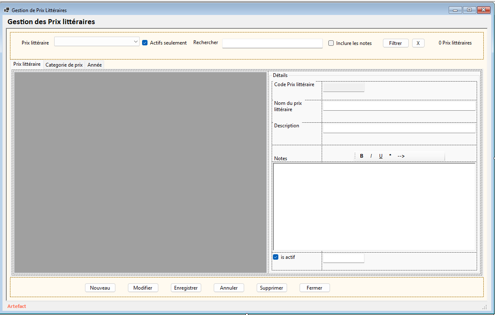

###### GestionPrixLit - Tab Categoorie de prix

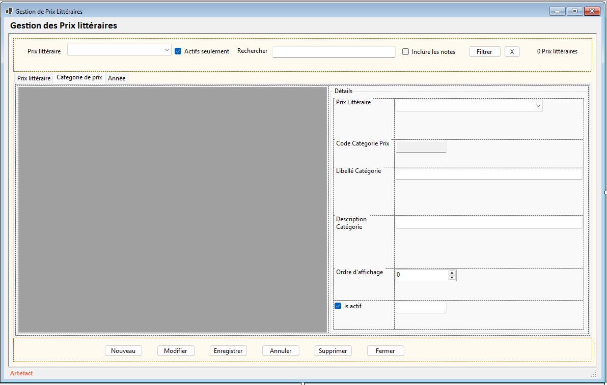

###### GestionPrixLit - Tab Année


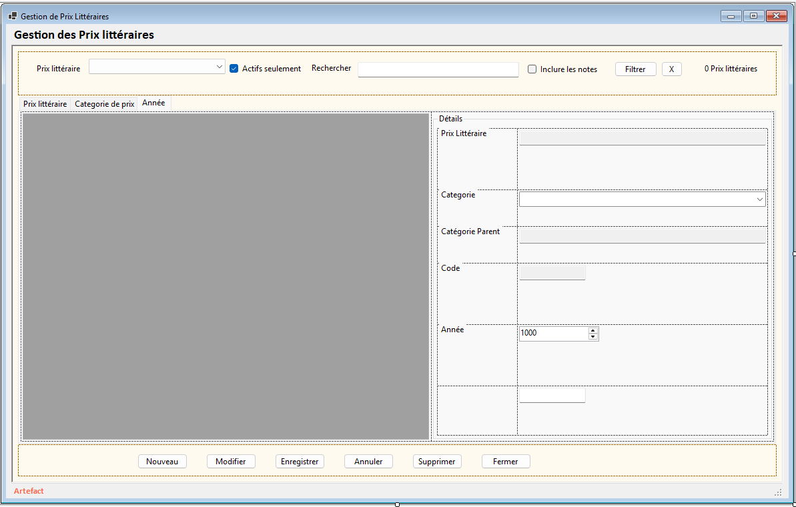


---

---
