# Documentation technique UI - Artefact

## Table des matières

1. [Vue d'ensemble](#1-vue-densemble)
2. [Architecture UI](#2-architecture-ui)
3. [Composants transverses](#3-composants-transverses)
4. [Forms](#4-forms)
5. [UserControls Référentiels](#5-usercontrols-référentiels)
6. [Checklist création UC](#6-checklist-création-uc)
7. [Règles clés](#7-règles-clés)

---

## 1. Vue d'ensemble

### 1.1 Objectif

Ce document décrit la structure technique et fonctionnelle complète de l'interface utilisateur d'Artefact.

Il permet de comprendre :
- Le rôle de chaque Form et UserControl
- Les tables concernées
- Les classes métier associées
- Les modules impliqués
- Les dépendances
- Les contrôles UI et leur lien avec la base

### 1.2 Architecture commune

```
UC/Form UI
   ↓
GestionReferentiel (partiel par domaine)
   ↓
QueryModule (partiel par domaine)
   ↓
DatabaseManager
   ↓
MariaDB
```

### 1.3 Modules transverses

| Élément                  | Rôle                                  |
| ------------------------ | ------------------------------------- |
| `DatabaseManager`        | Connexion MariaDB                     |
| `GestionReferentiel`     | CRUD + logique métier (partialisé)   |
| `QueryModule`            | Requêtes SQL (partialisé)             |
| `GestionLog`             | Logging                               |
| `UtilsForm`              | Helpers UI (ModeEdition, DGV)         |
| `UtilsUCReferentiels`    | Helpers partagés UC                   |
| `RichTextNotesHelper`    | Notes enrichies                       |
| `NavigationManager`      | Fil d'Ariane                          |
| `UserControlContext`     | Contexte partagé (ToolTip, ErrProv)  |
| `InputHelpers`           | Validation saisie                     |

---

## 2. Architecture UI

### 2.1 Migration Forms → UserControls (Mars 2026)

Les anciennes Forms de gestion (`GestionImpression`, `GestionRecommandations`, `GestionPrixLit`) ont été **migrées vers des UserControls** hébergés dans `PortailReferentiels`.

**Bénéfices** :
- Contexte partagé (ToolTip, ErrorProvider, StatusStrip, NavigationManager)
- Code factorisé via `UtilsUCReferentiels`
- Interface homogène avec fil d'Ariane
- Maintenance simplifiée

### 2.2 Structure actuelle

```
UI/
├── Forms_Portail/
│   ├── home.vb                    → Menu principal (point d'entrée)
│   └── PortailReferentiels.vb     → Portail hébergeant tous les UC
│
├── Forms_Config/
│   └── GestionConnexionMariaDb.vb → Configuration DB
│
├── Forms_Communs/
│   └── DialogChoix.vb             → Dialogue de confirmation réutilisable
│
└── UserControls_Referentiels/
	├── UC_Langues.vb              → Référentiel Langues
	├── UC_Pays.vb                 → Référentiel Pays
	├── UC_Contacts.vb             → Référentiel Contacts
	├── UC_Editeurs.vb             → Référentiel Éditeurs
	├── UC_FormatFile.vb           → Référentiel Formats fichiers
	├── UC_Impression.vb           → Référentiel Types impression
	├── UC_RefEnum.vb              → Référentiel Énumérations (hiérarchique 2 niveaux)
	├── UC_Recommandations.vb      → Référentiel Recommandations (hiérarchique 2 niveaux)
	├── UC_PrixLit.vb              → Référentiel Prix littéraires (hiérarchique 3 niveaux)
	└── UC_RichTextToolbar.vb      → Toolbar pour notes enrichies (composant réutilisable)
```

### 2.3 Typologie des UserControls

| Type                  | UC                                                           |
| --------------------- | ------------------------------------------------------------ |
| **Simples (1 table)** | Langues, Pays, Contacts, Editeurs, FormatFile, Impression   |
| **Hiérarchique 2 niveaux** | RefEnum (types + valeurs), Recommandations (origines + recommandations) |
| **Hiérarchique 3 niveaux** | PrixLit (prix → catégories → années)                        |
| **Composant réutilisable** | UC_RichTextToolbar                                          |

---

## 3. Composants transverses

### 3.1 UserControlContext

**Fichier** : `Utils/UserControlContext.vb`

**Rôle** : Contexte partagé fourni par `PortailReferentiels` à tous les UC.

**Propriétés** :
```vb
Public Class UserControlContext
	Public Property SharedToolTip As ToolTip
	Public Property SharedErrorProvider As ErrorProvider
	Public Property SharedStatusStrip As StatusStrip
	Public Property NavigationManager As NavigationManager
End Class
```

**Usage** :
Tous les UC référentiels implémentent `IContextAwareUserControl` et reçoivent ce contexte au chargement.

### 3.2 IContextAwareUserControl

**Fichier** : `Utils/IContextAwareUserControl.vb`

**Interface obligatoire** :
```vb
Public Interface IContextAwareUserControl
	Sub SetContext(context As UserControlContext)
End Interface
```

### 3.3 NavigationManager

**Fichier** : `Utils/NavigationManager.vb`

**Rôle** : Gestion du fil d'Ariane et de la navigation hiérarchique.

**Méthodes** :
- `PushNavigation(title As String)` : Ajoute un niveau
- `PopNavigation()` : Retour arrière
- `ClearNavigation()` : Réinitialise
- Synchronisation automatique avec label de navigation

**Usage** :
```vb
_context.NavigationManager.PushNavigation("Prix littéraires")
_context.NavigationManager.PushNavigation("Catégories")
```

### 3.4 UtilsUCReferentiels

**Fichier** : `Utils/UtilsUCReferentiels.vb`

**Rôle** : Helpers partagés pour tous les UC référentiels.

**Fonctions principales** :

#### Configuration UI
- `ConfigurerStyleGrid(dgv)` : Style DataGridView uniforme
- `ConfigurerBoutonsMode(mode, btnNew, btnEdit, btnSave, btnCancel, btnDelete, Optional btnNewChild)` : Gestion états boutons
- `ConfigurerRecherche(txtSearch, btnSearch, btnClear)` : Configuration zone de recherche

#### Validation
- `ValidateRequiredField(errProvider, control, fieldName, value)` : Validation champs requis

#### Conversions sécurisées
- `DbToBool(value)` : Boolean depuis DB
- `DbToInt(value)` : Integer depuis DB
- `SafeULong(value)` : ULong sécurisé

#### Manipulation DataGridView
- `HideTechnicalColumns(dgv)` : Masquage colonnes ID/codes
- `MasquerColonnesTechniques(dgv)` : Alias francophone
- `SetColonneVisible(dgv, columnName, visible)` : Visibilité colonne
- `UpdateCountLabel(lbl, count)` : Mise à jour compteur

#### Extraction valeurs
- `GetStringValue(row, columnName)` : String depuis DataGridViewRow
- `GetBoolValue(row, columnName)` : Boolean depuis DataGridViewRow
- `GetIntValue(row, columnName)` : Integer depuis DataGridViewRow

### 3.5 RichTextNotesHelper

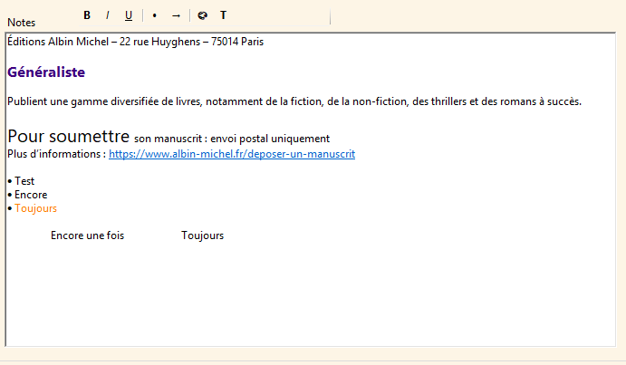

**Fichier** : `Utils/RichTextNotesHelper.vb`

**Rôle** : Système standardisé pour notes formatées.

**Principe** :
Chaque champ de notes est stocké dans deux colonnes :

- `xxx_rtf` : contenu formaté (affichage UI)
- `xxx_txt` : texte brut (recherche SQL)

**API** :
```vb
' Initialisation
RichTextNotesHelper.InitializeRichTextBox(rtb)

' Chargement
RichTextNotesHelper.LoadRtfContent(rtb, rtfFromDb)

' Sauvegarde
Dim rtfContent As String = RichTextNotesHelper.GetRtfContent(rtb)
Dim txtContent As String = RichTextNotesHelper.GetPlainText(rtb)

' Actions formatage
RichTextNotesHelper.ToggleBold(rtb)
RichTextNotesHelper.ToggleItalic(rtb)
RichTextNotesHelper.ToggleUnderline(rtb)
RichTextNotesHelper.ToggleBulletList(rtb)
```

**Règles** :
- Le RTF n'est **jamais** utilisé pour les recherches SQL
- Le texte brut n'est **jamais** utilisé pour l'affichage riche
- Toute manipulation passe par le helper

### 3.6 UtilsForm.ModeEdition

**Fichier** : `Utils/UtilsForm.vb`

**Enum partagé** :
```vb
Public Enum ModeEdition
	Consultation
	Nouveau
	Modification
End Enum
```

**Workflow standard** :
1. **Consultation** : Champs désactivés, navigation libre
2. **Nouveau** : Champs vides actifs, snapshot = Nothing
3. **Modification** : Champs actifs, snapshot pour annulation

---

## 4. Forms

### 4.1 home.vb

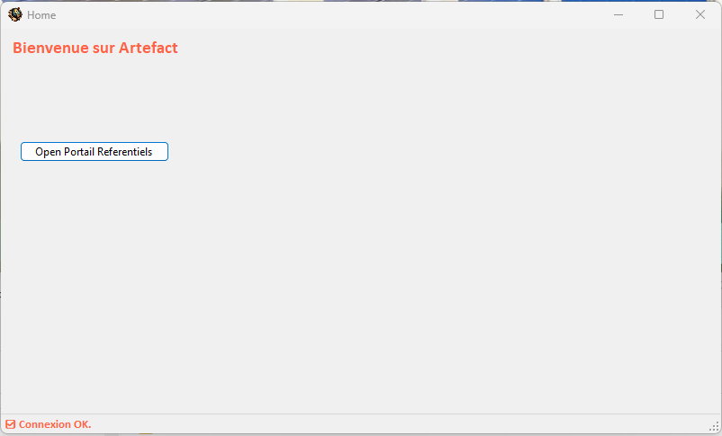

**Fichier** : `UI/Forms_Portail/home.vb`

**Rôle** : Menu principal de l'application (point d'entrée).

**Description** :
Form principale qui s'ouvre au démarrage de l'application. Contient le menu de navigation vers les différents modules de l'application.

**Boutons principaux** :
- `btnOpenPortailReferentiels` : Ouvre le portail des référentiels
- Autres boutons pour futurs modules (livres, auteurs, etc.)

**Modules liés** :
- `DatabaseManager` : Vérification connexion DB au démarrage
- `AppStartupManager` : Initialisation application
- `GestionLog` : Logging du démarrage

**Flux de démarrage** :
1. Vérification de la connexion MariaDB
2. Si connexion OK → activation navigation
3. Si échec → ouverture de `GestionConnexionMariaDb`

**Classes utilisées** :
- Aucune classe métier directe

**Contrôles principaux** :
- `pnlConnexion` : Panel avec boutons de navigation
- `stsStatus` : StatusStrip
- `lblTitre` : Titre de l'application

### 4.2 PortailReferentiels.vb

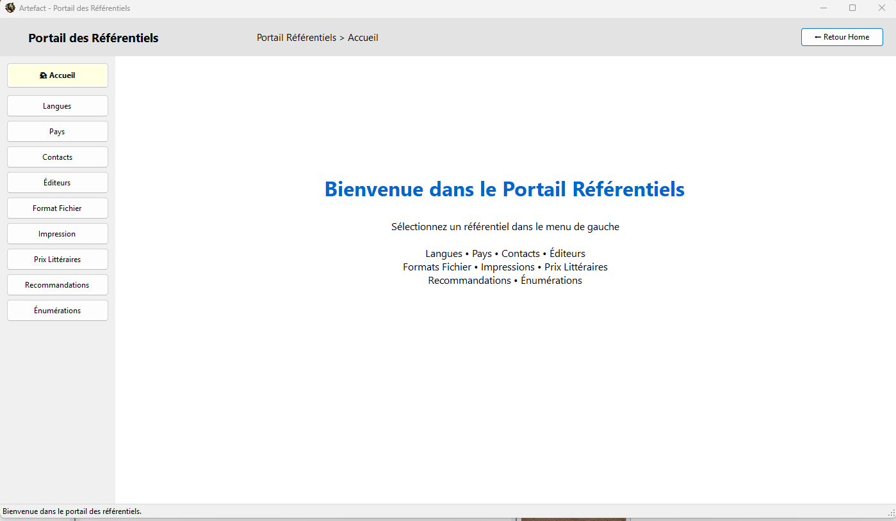

**Fichier** : `UI/Forms_Portail/PortailReferentiels.vb`

**Rôle** : Portail hébergeant tous les UserControls des référentiels.

**Description** :
Form conteneur qui charge dynamiquement les UC référentiels. Fournit le contexte partagé (ToolTip, ErrorProvider, StatusStrip, NavigationManager) à tous les UC.

**Fonctionnalités** :
- Chargement dynamique des UC
- Gestion du fil d'Ariane (NavigationManager)
- Contexte partagé pour tous les UC enfants
- Bouton "Retour Accueil" vers `home.vb`

**Modules liés** :
- `UserControlContext` : Construction du contexte
- `NavigationManager` : Gestion navigation
- Tous les UC référentiels via `IContextAwareUserControl`

**Contrôles principaux** :
- `pnlTop` : Zone navigation et titre
- `lblNavigation` : Fil d'Ariane
- `btnRetourAccueil` : Retour vers home
- `pnlUCContainer` : Conteneur pour UC dynamiques
- `ttpMain` : ToolTip partagé
- `errMain` : ErrorProvider partagé
- `stsStatus` : StatusStrip partagé

**Méthodes principales** :
- `LoadUserControl(Of T As {UserControl, IContextAwareUserControl, New})()` : Charge un UC et lui passe le contexte
- `InitializeContext()` : Initialise le UserControlContext

### 4.3 GestionConnexionMariaDb.vb

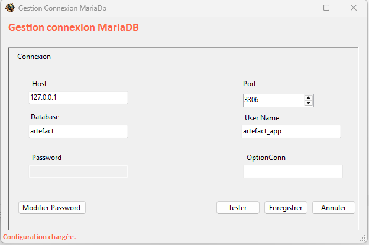

**Fichier** : `UI/Forms_Config/GestionConnexionMariaDb.vb`

**Rôle** : Configuration de la connexion à la base de données MariaDB.

**Description** :
Form permettant de configurer les paramètres de connexion (host, port, base, utilisateur, mot de passe). Permet de tester la connexion avant sauvegarde.

**Fonctionnalités** :
- Saisie des paramètres de connexion
- Test de connexion en temps réel
- Sauvegarde locale sécurisée (JSON + DPAPI)
- Chiffrement automatique du mot de passe
- Bouton "œil" pour visualisation temporaire du mot de passe

**Modules liés** :
- `DatabaseManager` : Test connexion
- `ConfigLocalManager` : Sauvegarde config
- `CryptoManagerDPAPI` : Chiffrement mot de passe
- `GestionLog` : Logging

**Classes utilisées** :
- `LocalDbConfig` : Modèle configuration

**Contrôles principaux** :
- `txtHost`, `txtPort`, `txtDatabase`, `txtUserName`, `txtPassword`
- `btnTestConnection` : Test connexion
- `btnSave` : Sauvegarde
- `btnShowPassword` : Visualisation temporaire mot de passe
- `stsStatus` : Messages de statut

**Règles** :
- Le mot de passe n'est jamais affiché en clair par défaut
- Toute modification de mot de passe est explicite
- Chiffrement via DPAPI (DataProtectionScope.CurrentUser)
- Aucun secret dans les logs

### 4.4 DialogChoix.vb

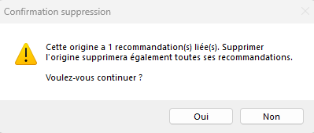

**Fichier** : `UI/Forms_Communs/DialogChoix.vb`

**Rôle** : Dialogue de confirmation/choix réutilisable.

**Description** :
Form de dialogue générique pour demandes de confirmation utilisateur. Remplace les MessageBox standards par une interface personnalisée cohérente.

**Fonctionnalités** :
- Titre personnalisable
- Message personnalisable
- Boutons configurables (Yes, No, Cancel)
- Icône contextuelle (Question, Warning, Info, Error)
- Retour DialogResult typé

**Usage** :
```vb
Dim dialog As New DialogChoix(
	"Confirmation",
	"Voulez-vous vraiment supprimer cet élément ?",
	showCancel:=True,
	icon:=DialogIcon.Question
)

Dim result As DialogResult = dialog.ShowDialog()

If result = DialogResult.Yes Then
	' Action de suppression
End If
```

**Enum DialogResult** :
```vb
Public Enum DialogResult
	Yes
	No
	Cancel
End Enum
```

**Enum DialogIcon** :
```vb
Public Enum DialogIcon
	Question
	Warning
	Info
	Error
End Enum
```

**Contrôles principaux** :
- `lblTitle` : Titre du dialogue
- `lblMessage` : Message
- `btnYes`, `btnNo`, `btnCancel` : Boutons de choix
- `picIcon` : Icône contextuelle

**Modules liés** :
- Aucun (composant UI pur)

---

## 5. UserControls Référentiels

### Structure standard UC référentiel

Tous les UC référentiels partagent la même structure de base :

**Contrôles obligatoires** :
- `pnlTop` : Titre + navigation
- `pnlSearch` : Recherche (TextBox + boutons)
- `tlpMain` : TableLayoutPanel (liste + détails)
- `dgv...` : DataGridView pour liste
- `pnlActions` : Boutons d'action
- Champs de détails (TextBox, ComboBox, etc.)

**Boutons standard** :
- `btnNew`, `btnEdit`, `btnSave`, `btnCancel`, `btnDelete`
- `btnSearch`, `btnClearSearch` (recherche)
- Pour UC hiérarchiques : `btnNew<Child>` pour niveau enfant

**Pattern implémentation** :
1. Implémenter `IContextAwareUserControl`
2. Recevoir contexte via `SetContext(context)`
3. Initialiser grilles avec `ConfigurerStyleGrid`
4. Gérer 3 modes : Consultation, Nouveau, Modification
5. Utiliser `ConfigurerBoutonsMode` pour états boutons
6. Valider avec `ValidateRequiredField`
7. Implémenter `SelectionChanged` + `BindSelectedToDetails()`

---

### 5.1 UC_Langues.vb

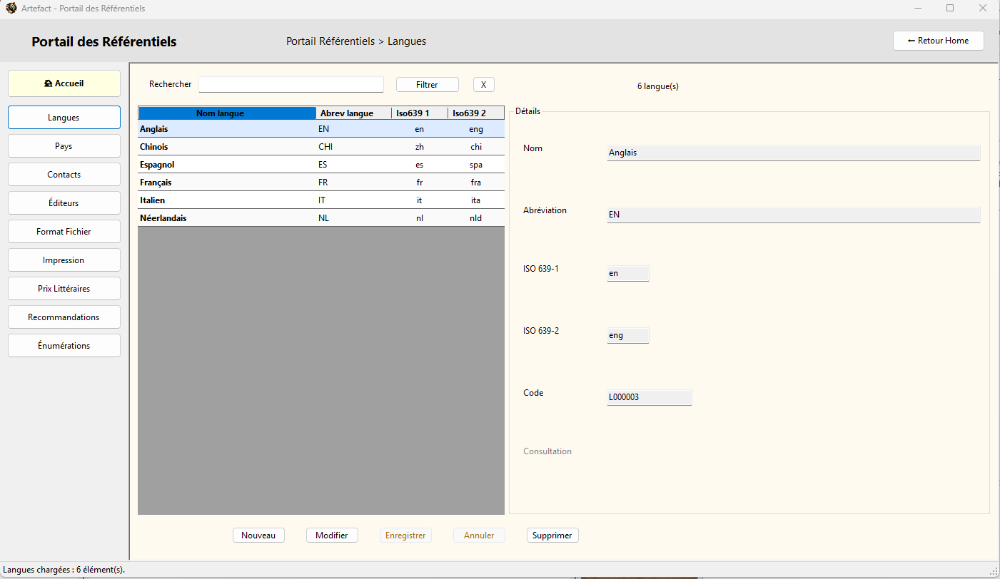

**Fichier** : `UI/UserControls_Referentiels/UC_Langues.vb`

**Rôle** : Gestion du référentiel des langues.

**Tables** :
- `langues`

**Classe métier** :
`Langue` (`Classes/Referentiels/Langue.vb`)
```vb
Public Property IdLangue As ULong
Public Property NomLangue As String
Public Property AbrevLangue As String
Public Property Iso639_1 As String
Public Property Iso639_2 As String
Public Property CodeLangue As String (GENERATED)
```

**Contrôles** :

| Contrôle         | Champ DB       | Type         |
| ---------------- | -------------- | ------------ |
| `dgvLangues`     | -              | DataGridView |
| `txtIdLangue`    | `id_langue`    | TextBox (RO) |
| `txtCodeLangue`  | `code_langue`  | TextBox (RO) |
| `txtNomLangue`   | `nom_langue`   | TextBox      |
| `txtAbrevLangue` | `abrev_langue` | TextBox      |
| `txtIso639_1`    | `iso639_1`     | TextBox      |
| `txtIso639_2`    | `iso639_2`     | TextBox      |

**GestionReferentiel** :
Module : `Metier/Referentiels/GestionReferentiel.vb`

| Méthode                     | Rôle                        |
| --------------------------- | --------------------------- |
| `Langue_GetAll()`           | Chargement liste complète   |
| `Langue_GetBySearch()`      | Recherche par nom/code      |
| `Langue_Insert()`           | Insertion nouvelle langue   |
| `Langue_Update()`           | Modification langue         |
| `Langue_Delete()`           | Suppression langue          |
| `Langue_CountDependances()` | Vérification usages (livres)|

**QueryModule** :
Module : `Core/Query/QueryModule.vb`

| Requête                   | Rôle                |
| ------------------------- | ------------------- |
| `Langue_SelectAll`        | Liste complète      |
| `Langue_SelectBySearch`   | Recherche           |
| `Langue_Insert`           | INSERT              |
| `Langue_Update`           | UPDATE              |
| `Langue_Delete`           | DELETE              |
| `Langue_CountDependances` | COUNT dépendances   |

**Règles métier** :
- ISO 639-1 : 2 caractères minuscules (ex: "fr")
- ISO 639-2 : 3 caractères minuscules (ex: "fra")
- `code_langue` généré automatiquement par DB

**Usage** :
Langue principale pour filtrage et catégorisation des livres.

(IMAGE: UC_Langues.png)

---

### 5.2 UC_Pays.vb

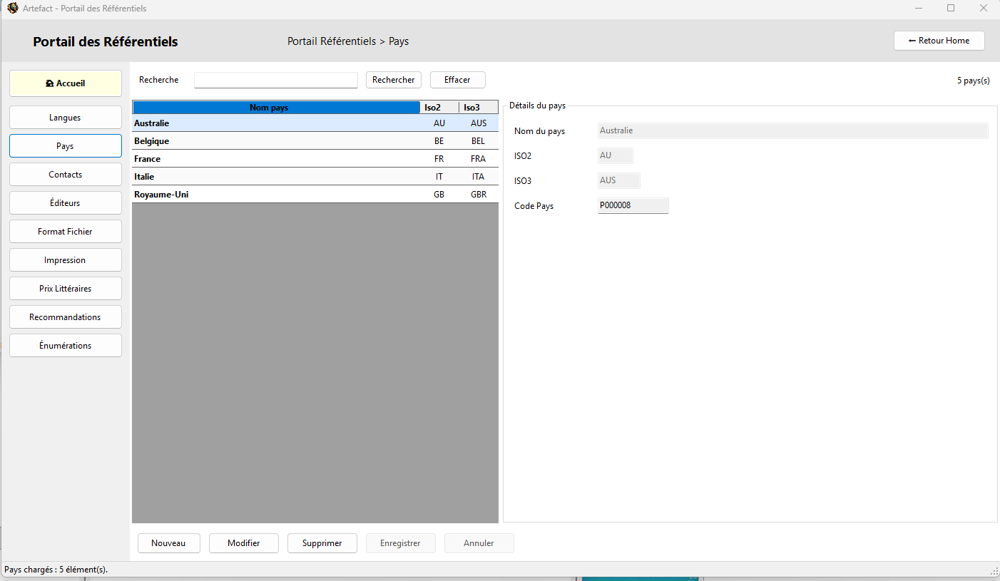

**Fichier** : `UI/UserControls_Referentiels/UC_Pays.vb`

**Rôle** : Gestion du référentiel des pays.

**Tables** :
- `pays`

**Classe métier** :
`Pays` (`Classes/Referentiels/Pays.vb`)
```vb
Public Property IdPays As ULong
Public Property NomPays As String
Public Property Iso2 As String
Public Property Iso3 As String
Public Property CodePays As String (GENERATED)
```

**Contrôles** :

| Contrôle      | Champ DB    | Type         |
| ------------- | ----------- | ------------ |
| `dgvPays`     | -           | DataGridView |
| `txtIdPays`   | `id_pays`   | TextBox (RO) |
| `txtCodePays` | `code_pays` | TextBox (RO) |
| `txtNomPays`  | `nom_pays`  | TextBox      |
| `txtIso2`     | `iso2`      | TextBox      |
| `txtIso3`     | `iso3`      | TextBox      |

**GestionReferentiel** :

| Méthode                   | Rôle                        |
| ------------------------- | --------------------------- |
| `Pays_GetAll()`           | Chargement liste            |
| `Pays_GetBySearch()`      | Recherche                   |
| `Pays_Insert()`           | Insertion                   |
| `Pays_Update()`           | Modification                |
| `Pays_Delete()`           | Suppression                 |
| `Pays_CountDependances()` | Vérification usages         |

**QueryModule** :

| Requête                 | Rôle          |
| ----------------------- | ------------- |
| `Pays_SelectAll`        | Liste         |
| `Pays_SelectBySearch`   | Recherche     |
| `Pays_Insert`           | INSERT        |
| `Pays_Update`           | UPDATE        |
| `Pays_Delete`           | DELETE        |
| `Pays_CountDependances` | COUNT usages  |

**Règles métier** :
- ISO 3166-1 alpha-2 : 2 caractères MAJUSCULES (ex: "FR")
- ISO 3166-1 alpha-3 : 3 caractères MAJUSCULES (ex: "FRA")
- `code_pays` généré automatiquement par DB

**Usage** :
Pays d'origine pour auteurs, éditeurs, prix littéraires.

(IMAGE: UC_Pays.png)

---

### 5.3 UC_Contacts.vb

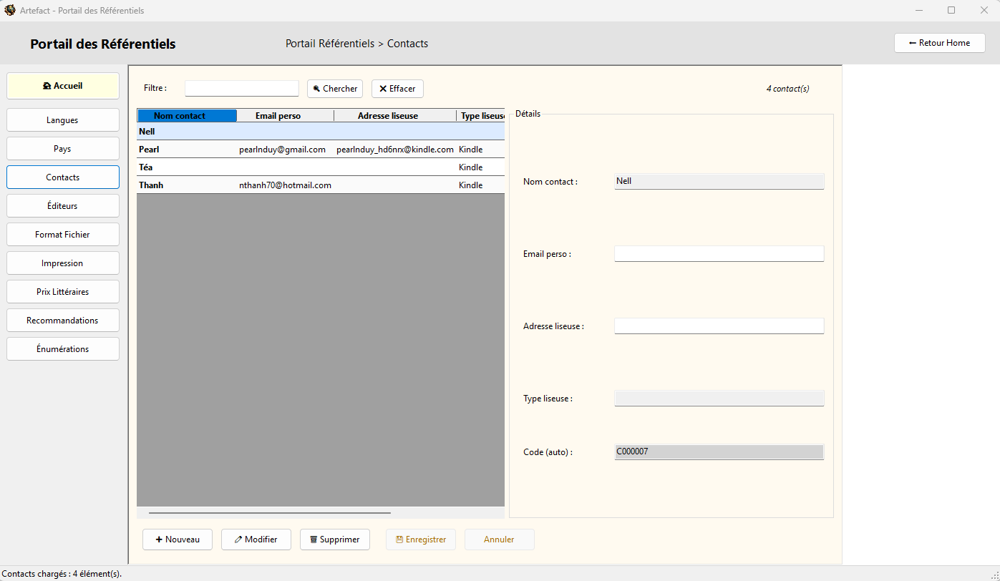

**Fichier** : `UI/UserControls_Referentiels/UC_Contacts.vb`

**Rôle** : Gestion du référentiel des contacts (destinataires livres).

**Tables** :
- `contacts`

**Classe métier** :
`Contact` (`Classes/Referentiels/Contact.vb`)
```vb
Public Property IdContact As ULong
Public Property CodeContact As String (GENERATED)
Public Property NomContact As String
Public Property EmailPerso As String
Public Property AdresseLiseuse As String
Public Property TypeLiseuse As String
```

**Contrôles** :

| Contrôle            | Champ DB          | Type         |
| ------------------- | ----------------- | ------------ |
| `dgvContacts`       | -                 | DataGridView |
| `txtIdContact`      | `id_contact`      | TextBox (RO) |
| `txtCodeContact`    | `code_contact`    | TextBox (RO) |
| `txtNomContact`     | `nom_contact`     | TextBox      |
| `txtEmailPerso`     | `email_perso`     | TextBox      |
| `txtAdresseLiseuse` | `adresse_liseuse` | TextBox      |
| `txtTypeLiseuse`    | `type_liseuse`    | TextBox      |

**GestionReferentiel** :
Module : `Metier/Referentiels/GestionReferentiel.ContactsEditeurs.vb`

| Méthode                 | Rôle                    |
| ----------------------- | ----------------------- |
| `Contact_GetAll()`      | Chargement              |
| `Contact_GetBySearch()` | Recherche               |
| `Contact_Insert()`      | Insertion               |
| `Contact_Update()`      | Modification            |
| `Contact_Delete()`      | Suppression             |
| `Contact_CountLivres()` | Vérification usages     |

**QueryModule** :
Module : `Core/Query/QueryModule.ContactsEditeurs.vb`

| Requête                  | Rôle      |
| ------------------------ | --------- |
| `Contact_SelectAll`      | Liste     |
| `Contact_SelectBySearch` | Recherche |
| `Contact_Insert`         | INSERT    |
| `Contact_Update`         | UPDATE    |
| `Contact_Delete`         | DELETE    |
| `Contact_CountLivres`    | COUNT     |

**Règles métier** :
- `nom_contact` obligatoire
- Email et adresse liseuse optionnels
- `code_contact` généré automatiquement

**Usage** :
Liste des personnes à qui on envoie des livres numériques (famille, amis).

(IMAGE: UC_Contacts.png)

---

### 5.4 UC_Editeurs.vb

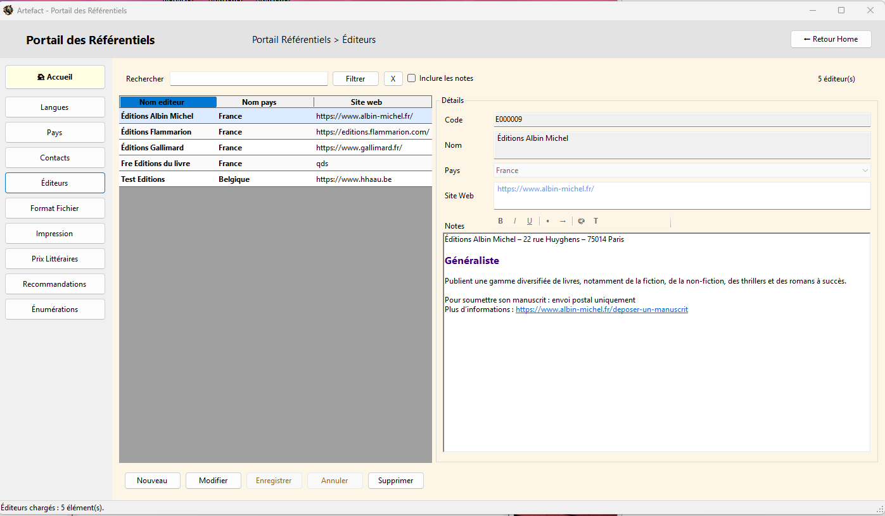

**Fichier** : `UI/UserControls_Referentiels/UC_Editeurs.vb`

**Rôle** : Gestion du référentiel des éditeurs.

**Tables** :
- `editeurs`
- `pays` (FK optionnelle)

**Classe métier** :
`Editeur` (`Classes/Referentiels/Editeur.vb`)
```vb
Public Property IdEditeur As ULong
Public Property CodeEditeur As String (GENERATED)
Public Property NomEditeur As String
Public Property IdPays As ULong?
Public Property SiteWeb As String
Public Property NotesEditeurRtf As String
Public Property NotesEditeurTxt As String
```

**Contrôles** :

| Contrôle          | Champ DB                  | Type         |
| ----------------- | ------------------------- | ------------ |
| `dgvEditeurs`     | -                         | DataGridView |
| `txtIdEditeur`    | `id_editeur`              | TextBox (RO) |
| `txtCodeEditeur`  | `code_editeur`            | TextBox (RO) |
| `txtNomEditeur`   | `nom_editeur`             | TextBox      |
| `cboPaysEditeur`  | `id_pays`                 | ComboBox     |
| `txtSiteWeb`      | `site_web`                | TextBox      |
| `rtbNotesEditeur` | `notes_editeur_rtf / txt` | RichTextBox  |
| `chkSearchNotes`  | -                         | CheckBox     |

**GestionReferentiel** :
Module : `Metier/Referentiels/GestionReferentiel.ContactsEditeurs.vb`

| Méthode                 | Rôle                |
| ----------------------- | ------------------- |
| `Editeur_GetAll()`      | Chargement          |
| `Editeur_GetBySearch()` | Recherche           |
| `Editeur_Insert()`      | Insertion           |
| `Editeur_Update()`      | Modification        |
| `Editeur_Delete()`      | Suppression         |
| `Editeur_CountLivres()` | Vérification usages |

**QueryModule** :
Module : `Core/Query/QueryModule.ContactsEditeurs.vb`

| Requête                  | Rôle      |
| ------------------------ | --------- |
| `Editeur_SelectAll`      | Liste     |
| `Editeur_SelectBySearch` | Recherche |
| `Editeur_Insert`         | INSERT    |
| `Editeur_Update`         | UPDATE    |
| `Editeur_Delete`         | DELETE    |
| `Editeur_CountLivres`    | COUNT     |

**Règles métier** :
- `nom_editeur` obligatoire
- Pays optionnel (ComboBox avec "(aucun)")
- Notes enrichies via `RichTextNotesHelper`
- Recherche optionnelle dans notes (`chkSearchNotes`)

**Usage** :
Éditeurs des livres, avec notes libres formatées.

(IMAGE: UC_Editeurs.png)

---

### 5.5 UC_FormatFile.vb

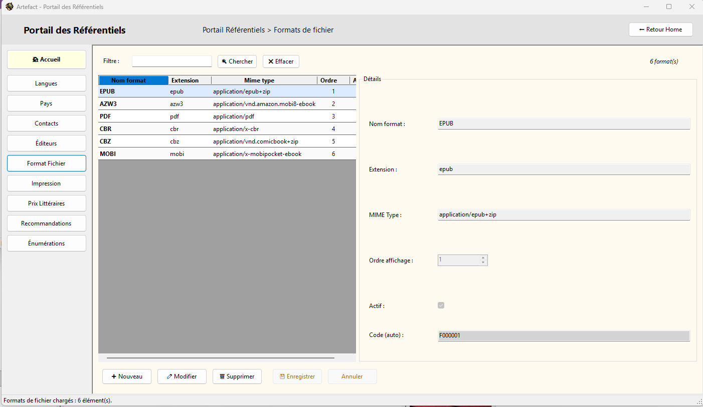

**Fichier** : `UI/UserControls_Referentiels/UC_FormatFile.vb`

**Rôle** : Gestion du référentiel des formats de fichiers.

**Tables** :
- `formatFile`

**Classe métier** :
`FormatFile` (`Classes/Referentiels/FormatFile.vb`)
```vb
Public Property IdFormatFile As ULong
Public Property CodeFormatFile As String (GENERATED)
Public Property NomFormat As String
Public Property Extension As String
Public Property MimeType As String
Public Property OrdreAffichage As Integer
Public Property IsActif As Boolean
```

**Contrôles** :

| Contrôle             | Champ DB          | Type               |
| -------------------- | ----------------- | ------------------ |
| `dgvFormatFile`      | -                 | DataGridView       |
| `txtIdFormatFile`    | `id_formatFile`   | TextBox (RO)       |
| `txtCodeFormatFile`  | `code_formatFile` | TextBox (RO)       |
| `txtNomFormat`       | `nom_format`      | TextBox            |
| `txtExtension`       | `extension`       | TextBox            |
| `txtMimeType`        | `mime_type`       | TextBox            |
| `nudOrdreAffichage`  | `ordre_affichage` | NumericUpDown      |
| `chkFormatFileActif` | `is_actif`        | CheckBox           |

**GestionReferentiel** :
Module : `Metier/Referentiels/GestionReferentiel.FormatFileImpressions.vb`

| Méthode                            | Rôle                |
| ---------------------------------- | ------------------- |
| `FormatFile_GetAll()`              | Chargement          |
| `FormatFile_GetBySearch()`         | Recherche           |
| `FormatFile_Insert()`              | Insertion           |
| `FormatFile_Update()`              | Modification        |
| `FormatFile_Delete()`              | Suppression         |
| `FormatFile_CountLivresFichiers()` | Vérification usages |

**QueryModule** :
Module : `Core/Query/QueryModule.FormatFileImpression.vb`

| Requête                          | Rôle    |
| -------------------------------- | ------- |
| `FormatFile_SelectAll`           | Liste   |
| `FormatFile_SelectBySearch`      | Recherche |
| `FormatFile_Insert`              | INSERT  |
| `FormatFile_Update`              | UPDATE  |
| `FormatFile_Delete`              | DELETE  |
| `FormatFile_CountLivresFichiers` | COUNT   |

**Règles métier** :
- `nom_format` obligatoire (ex: "EPUB", "PDF", "MOBI")
- Extension avec point (ex: ".epub")
- MIME type optionnel (ex: "application/epub+zip")
- Ordre d'affichage pour tri UI
- Flag actif/inactif

**Usage** :
Formats de fichiers supportés pour les livres numériques.

(IMAGE: UC_FormatFile.png)

---

### 5.6 UC_Impression.vb

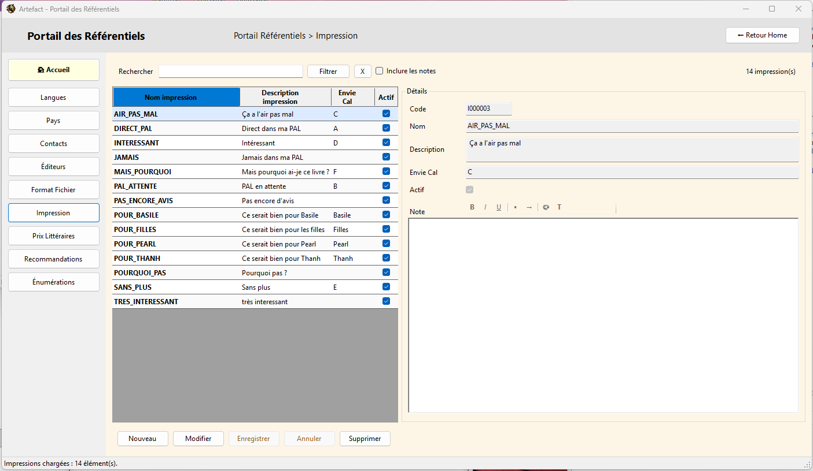

**Fichier** : `UI/UserControls_Referentiels/UC_Impression.vb`

**Rôle** : Gestion du référentiel des types d'impression.

**Tables** :
- `impression`

**Classe métier** :
`Impression` (`Classes/Referentiels/Impression.vb`)
```vb
Public Property IdImpression As ULong
Public Property CodeImpression As String (GENERATED)
Public Property NomImpression As String
Public Property DescriptionImpression As String
Public Property NoteRtf As String
Public Property NoteTxt As String
Public Property EnvieCal As String
Public Property IsActif As Boolean
```

**Contrôles** :

| Contrôle                   | Champ DB                 | Type         |
| -------------------------- | ------------------------ | ------------ |
| `dgvImpression`            | -                        | DataGridView |
| `txtIdImpression`          | `id_impression`          | TextBox (RO) |
| `txtCodeImpression`        | `code_impression`        | TextBox (RO) |
| `txtNomImpression`         | `nom_impression`         | TextBox      |
| `txtDescriptionImpression` | `description_impression` | TextBox      |
| `rtbNoteImpression`        | `note_rtf / txt`         | RichTextBox  |
| `txtEnvieCal`              | `envie_Cal`              | TextBox      |
| `chkImpressionActive`      | `is_actif`               | CheckBox     |
| `chkSearchNotes`           | -                        | CheckBox     |

**GestionReferentiel** :
Module : `Metier/Referentiels/GestionReferentiel.FormatFileImpressions.vb`

| Méthode                    | Rôle                |
| -------------------------- | ------------------- |
| `Impression_GetAll()`      | Chargement          |
| `Impression_GetBySearch()` | Recherche           |
| `Impression_Insert()`      | Insertion           |
| `Impression_Update()`      | Modification        |
| `Impression_Delete()`      | Suppression         |
| `Impression_CountLivres()` | Vérification usages |

**QueryModule** :
Module : `Core/Query/QueryModule.FormatFileImpression.vb`

| Requête                     | Rôle      |
| --------------------------- | --------- |
| `Impression_SelectAll`      | Liste     |
| `Impression_SelectBySearch` | Recherche |
| `Impression_Insert`         | INSERT    |
| `Impression_Update`         | UPDATE    |
| `Impression_Delete`         | DELETE    |
| `Impression_CountLivres`    | COUNT     |

**Règles métier** :
- `nom_impression` obligatoire (ex: "Broché", "Poche", "Grand format")
- Description optionnelle
- Notes enrichies via `RichTextNotesHelper`
- Champ `envie_Cal` : correspondance avec Calibre
- Flag actif/inactif

**Usage** :
Types d'impression pour livres physiques (broché, poche, etc.).

(IMAGE: UC_Impression.png)

---

### 5.7 UC_RefEnum.vb (Hiérarchique 2 niveaux)

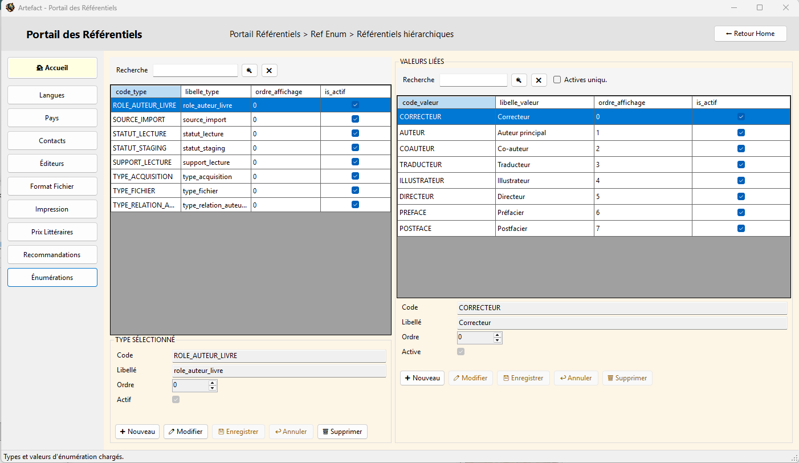

**Fichier** : `UI/UserControls_Referentiels/UC_RefEnum.vb`

**Rôle** : Gestion du référentiel des énumérations dynamiques.

**Tables** :
- `ref_enum_type` (types/catégories)
- `ref_enum` (valeurs)

**Classes métier** :
`RefEnumType` (`Classes/Referentiels/RefEnumType.vb`)
```vb
Public Property IdEnumType As ULong
Public Property CodeEnumType As String (GENERATED)
Public Property CodeType As String
Public Property LibelleType As String
Public Property OrdreAffichage As Integer
Public Property IsActif As Boolean
```

`RefEnumValeur` (`Classes/Referentiels/RefEnumValeur.vb`)
```vb
Public Property IdEnum As ULong
Public Property CodeEnum As String (GENERATED)
Public Property IdEnumType As ULong (FK)
Public Property CodeValeur As String
Public Property LibelleValeur As String
Public Property OrdreAffichage As Integer
Public Property IsActif As Boolean
```

**Structure hiérarchique** :
- **Niveau 1 (Types)** : Ex: "TYPE_ACQUISITION", "STATUT_LECTURE"
- **Niveau 2 (Valeurs)** : Ex: pour TYPE_ACQUISITION → "ACHAT", "CADEAU", "EMPRUNT"

**Contrôles** :

| Contrôle                  | Champ DB          | Type            |
| ------------------------- | ----------------- | --------------- |
| `dgvRefEnumTypes`         | -                 | DataGridView    |
| `dgvRefEnumValeurs`       | -                 | DataGridView    |
| `txtIdEnumType`           | `id_enum_type`    | TextBox (RO)    |
| `txtCodeEnumType`         | `code_enum_type`  | TextBox (RO)    |
| `txtCodeType`             | `code_type`       | TextBox         |
| `txtLibelleType`          | `libelle_type`    | TextBox         |
| `nudOrdreAffichageType`   | `ordre_affichage` | NumericUpDown   |
| `chkEnumTypeActif`        | `is_actif`        | CheckBox        |
| `txtIdEnum`               | `id_enum`         | TextBox (RO)    |
| `txtCodeEnum`             | `code_enum`       | TextBox (RO)    |
| `cboEnumTypeParent`       | `id_enum_type`    | ComboBox        |
| `txtCodeValeur`           | `code_valeur`     | TextBox         |
| `txtLibelleValeur`        | `libelle_valeur`  | TextBox         |
| `nudOrdreAffichageValeur` | `ordre_affichage` | NumericUpDown   |
| `chkEnumValeurActive`     | `is_actif`        | CheckBox        |

**GestionReferentiel** :
Module : `Metier/Referentiels/GestionReferentiel.RefEnum.vb`

| Méthode                      | Rôle                    |
| ---------------------------- | ----------------------- |
| `RefEnumType_GetAll()`       | Types                   |
| `RefEnumType_Insert()`       | Insertion type          |
| `RefEnumType_Update()`       | Modification type       |
| `RefEnumType_Delete()`       | Suppression type        |
| `RefEnum_GetByType()`        | Valeurs par type        |
| `RefEnum_Insert()`           | Insertion valeur        |
| `RefEnum_Update()`           | Modification valeur     |
| `RefEnum_Delete()`           | Suppression valeur      |
| `RefEnum_CountDependances()` | Vérification usages     |

**QueryModule** :
Module : `Core/Query/QueryModule.RefEnum.vb`

| Requête                    | Rôle     |
| -------------------------- | -------- |
| `RefEnumType_SelectAll`    | Types    |
| `RefEnumType_Insert`       | INSERT   |
| `RefEnumType_Update`       | UPDATE   |
| `RefEnumType_Delete`       | DELETE   |
| `RefEnum_SelectByType`     | Valeurs  |
| `RefEnum_Insert`           | INSERT   |
| `RefEnum_Update`           | UPDATE   |
| `RefEnum_Delete`           | DELETE   |
| `RefEnum_CountDependances` | COUNT    |

**Règles métier** :
- Codes techniques en MAJUSCULES (ex: "TYPE_ACQUISITION", "ACHAT")
- Libellés en casse normale (ex: "Type d'acquisition", "Achat")
- Tri par `ordre_affichage` puis `libelle`
- Flag actif/inactif à chaque niveau
- Bouton "Nouveau valeur" désactivé si aucun type sélectionné

**Usage** :
Système d'énumérations dynamiques utilisé par plusieurs tables métier (type d'acquisition, statut lecture, etc.).

(IMAGE: UC_RefEnum_1.png - Tab Types)
(IMAGE: UC_RefEnum_2.png - Tab Valeurs)

---

### 5.8 UC_Recommandations.vb (Hiérarchique 2 niveaux)

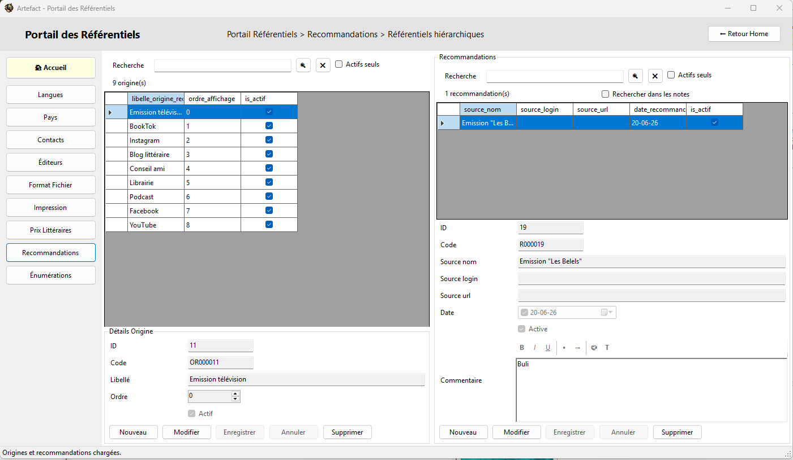

**Fichier** : `UI/UserControls_Referentiels/UC_Recommandations.vb`

**Rôle** : Gestion du référentiel des recommandations de livres.

**Tables** :
- `origines_recommandation` (origines/sources)
- `recommandations` (recommandations détaillées)
- `livres_recommandations` (liaison)
- `livres_staging_recommandations` (liaison)

**Classes métier** :
`RefOrigineRecommandation` (`Classes/Referentiels/RefOrigineRecommandation.vb`)
```vb
Public Property IdOrigineRecommandation As ULong
Public Property CodeOrigineRecommandation As String (GENERATED)
Public Property LibelleOrigineRecommandation As String
Public Property OrdreAffichage As Integer
Public Property IsActif As Boolean
```

`Recommandation` (`Classes/Referentiels/Recommandation.vb`)
```vb
Public Property IdRecommandation As ULong
Public Property CodeRecommandation As String (GENERATED)
Public Property IdOrigineRecommandation As ULong (FK)
Public Property SourceNom As String
Public Property SourceLogin As String
Public Property SourceURL As String
Public Property DateRecommandation As Date?
Public Property CommentaireRtf As String
Public Property CommentaireTxt As String
Public Property IsActif As Boolean
```

**Structure hiérarchique** :
- **Niveau 1 (Origines)** : Ex: "Blog", "TikTok", "Ami", "Libraire"
- **Niveau 2 (Recommandations)** : Détails de chaque recommandation avec source, URL, date, commentaire

**Contrôles** :

| Contrôle                          | Champ DB                         | Type          |
| --------------------------------- | -------------------------------- | ------------- |
| `dgvOriginesRecommandation`       | -                                | DataGridView  |
| `dgvRecommandations`              | -                                | DataGridView  |
| `txtIdOrigineRecommandation`      | `id_origine_recommandation`      | TextBox (RO)  |
| `txtCodeOrigineRecommandation`    | `code_origine_recommandation`    | TextBox (RO)  |
| `txtLibelleOrigineRecommandation` | `libelle_origine_recommandation` | TextBox       |
| `nudOrdreAffichageOrigine`        | `ordre_affichage`                | NumericUpDown |
| `chkOrigineRecommandationActive`  | `is_actif`                       | CheckBox      |
| `txtIdRecommandation`             | `id_recommandation`              | TextBox (RO)  |
| `txtCodeRecommandation`           | `code_recommandation`            | TextBox (RO)  |
| `cboOrigineRecommandation`        | `id_origine_recommandation`      | ComboBox      |
| `cboFiltreOrigineRecommandation`  | -                                | ComboBox      |
| `txtSourceNom`                    | `source_nom`                     | TextBox       |
| `txtSourceLogin`                  | `source_login`                   | TextBox       |
| `txtSourceUrl`                    | `source_url`                     | TextBox       |
| `dtpDateRecommandation`           | `date_recommandation`            | DateTimePicker|
| `rtbCommentaireRecommandation`    | `commentaire_rtf / txt`          | RichTextBox   |
| `chkRecommandationActive`         | `is_actif`                       | CheckBox      |
| `chkSearchNotes`                  | -                                | CheckBox      |
| `chkActifsOnly`                   | -                                | CheckBox      |

**GestionReferentiel** :
Module : `Metier/Referentiels/GestionReferentiel.Recommandations.vb`

| Méthode                          | Rôle                    |
| -------------------------------- | ----------------------- |
| `OrigineRecommandation_GetAll()` | Origines                |
| `OrigineRecommandation_Insert()` | Insertion origine       |
| `OrigineRecommandation_Update()` | Modification origine    |
| `OrigineRecommandation_Delete()` | Suppression origine     |
| `Recommandation_GetAll()`        | Liste recommandations   |
| `Recommandation_GetBySearch()`   | Recherche               |
| `Recommandation_GetByOrigine()`  | Filtre par origine      |
| `Recommandation_Insert()`        | Insertion               |
| `Recommandation_Update()`        | Modification            |
| `Recommandation_Delete()`        | Suppression             |
| `Recommandation_CountUsages()`   | Vérification usages     |

**QueryModule** :
Module : `Core/Query/QueryModule.Recommandations.vb`

| Requête                           | Rôle      |
| --------------------------------- | --------- |
| `OrigineRecommandation_SelectAll` | Origines  |
| `OrigineRecommandation_Insert`    | INSERT    |
| `OrigineRecommandation_Update`    | UPDATE    |
| `OrigineRecommandation_Delete`    | DELETE    |
| `Recommandation_SelectAll`        | Liste     |
| `Recommandation_SelectBySearch`   | Recherche |
| `Recommandation_SelectByOrigine`  | Filtre    |
| `Recommandation_Insert`           | INSERT    |
| `Recommandation_Update`           | UPDATE    |
| `Recommandation_Delete`           | DELETE    |
| `Recommandation_CountUsages`      | COUNT     |

**Règles métier** :
- Une recommandation = un événement documenté
- Origine obligatoire (blog, ami, etc.)
- SourceNom obligatoire (nom de la source)
- URL et login optionnels
- Date optionnelle
- Commentaire via notes enrichies
- Bouton "Nouvelle recommandation" désactivé si aucune origine sélectionnée
- Filtrage par origine via ComboBox "Toutes origines"
- Filtre actifs uniquement optionnel

**Usage** :
Documenter les sources de découverte de livres pour analyse ultérieure.

(IMAGE: UC_Recommandations_1.png - Tab Origines)
(IMAGE: UC_Recommandations_2.png - Tab Recommandations)

---

### 5.9 UC_PrixLit.vb (Hiérarchique 3 niveaux)

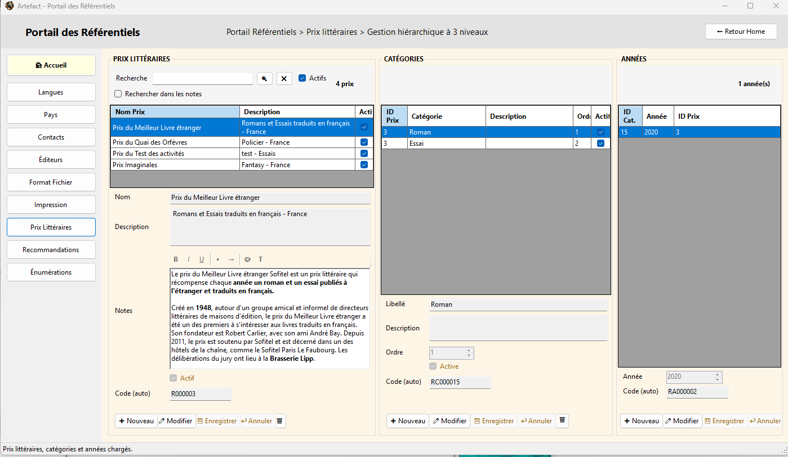

**Fichier** : `UI/UserControls_Referentiels/UC_PrixLit.vb`

**Rôle** : Gestion du référentiel des prix littéraires.

**Tables** :
- `prixlit` (prix)
- `prixlit_categorie` (catégories par prix)
- `prixlit_annee` (années par catégorie)
- `livres_prixlit_annee` (liaison livres)

**Classes métier** :
`PrixLit` (`Classes/Referentiels/PrixLit.vb`)
```vb
Public Property IdPrixLit As ULong
Public Property CodePrixLit As String (GENERATED)
Public Property NomPrixLit As String
Public Property DescriptionPrixLit As String
Public Property NotesPrixLitRtf As String
Public Property NotesPrixLitTxt As String
Public Property IsActif As Boolean
Public Property CreatedAt As DateTime
Public Property UpdatedAt As DateTime
```

`PrixLitCategorie` (`Classes/Referentiels/PrixLitCategorie.vb`)
```vb
Public Property IdPrixLitCategorie As ULong
Public Property CodePrixLitCategorie As String (GENERATED)
Public Property IdPrixLit As ULong (FK)
Public Property LibelleCategorie As String
Public Property DescriptionCategorie As String
Public Property OrdreAffichage As Integer
Public Property IsActif As Boolean
Public Property CreatedAt As DateTime
Public Property UpdatedAt As DateTime
```

`PrixLitAnnee` (`Classes/Referentiels/PrixLitAnnee.vb`)
```vb
Public Property IdPrixLitAnnee As ULong
Public Property CodePrixLitAnnee As String (GENERATED)
Public Property IdPrixLitCategorie As ULong (FK)
Public Property Annee As Integer
Public Property CreatedAt As DateTime
Public Property UpdatedAt As DateTime
```

**Structure hiérarchique** :
- **Niveau 1 (Prix)** : Ex: "Prix Goncourt", "Prix Renaudot"
- **Niveau 2 (Catégories)** : Ex: pour Goncourt → "Roman", "Premier roman", "Nouvelle"
- **Niveau 3 (Années)** : Ex: pour Goncourt/Roman → 2023, 2024, 2025

**Contrôles** :

| Contrôle                       | Champ DB                 | Type            |
| ------------------------------ | ------------------------ | --------------- |
| `dgvPrixLit`                   | -                        | DataGridView    |
| `dgvPrixLitCategorie`          | -                        | DataGridView    |
| `dgvPrixLitAnnee`              | -                        | DataGridView    |
| `txtIdPrixLit`                 | `id_prixLit`             | TextBox (RO)    |
| `txtCodePrixLit`               | `code_prixLit`           | TextBox (RO)    |
| `txtNomPrixLit`                | `nom_prixLit`            | TextBox         |
| `txtDescriptionPrixLit`        | `description_prixLit`    | TextBox         |
| `rtbNotesPrixLit`              | `Notes_rtf / txt`        | RichTextBox     |
| `chkPrixLitActif`              | `is_actif`               | CheckBox        |
| `chkRechercheDansNotesPrixLit` | -                        | CheckBox        |
| `txtIdPrixLitCategorie`        | `id_prixlit_categorie`   | TextBox (RO)    |
| `txtCodePrixLitCategorie`      | `code_prixlit_categorie` | TextBox (RO)    |
| `cboPrixLitParentCategorie`    | `id_prixLit`             | ComboBox        |
| `txtLibelleCategorie`          | `libelle_categorie`      | TextBox         |
| `txtDescriptionCategorie`      | `description_categorie`  | TextBox         |
| `nudOrdreAffichageCategorie`   | `ordre_affichage`        | NumericUpDown   |
| `chkPrixLitCategorieActif`     | `is_actif`               | CheckBox        |
| `txtIdPrixLitAnnee`            | `id_prixLit_Annee`       | TextBox (RO)    |
| `txtCodePrixLitAnnee`          | `code_prixLit_Annee`     | TextBox (RO)    |
| `cboPrixLitCategorieAnnee`     | `id_prixlit_categorie`   | ComboBox        |
| `nudAnneePrixLit`              | `annee`                  | NumericUpDown   |
| `cboFiltrePrixLit`             | -                        | ComboBox        |
| `chkActifsOnly`                | -                        | CheckBox        |

**GestionReferentiel** :
Module : `Metier/Referentiels/GestionReferentiel.PrixLit.vb`

| Méthode                          | Rôle                    |
| -------------------------------- | ----------------------- |
| `PrixLit_GetAll()`               | Prix                    |
| `PrixLit_Insert()`               | Insertion prix          |
| `PrixLit_Update()`               | Modification prix       |
| `PrixLit_Delete()`               | Suppression prix        |
| `PrixLit_CountCategories()`      | Vérification catégories |
| `PrixLitCategorie_GetByPrix()`   | Catégories par prix     |
| `PrixLitCategorie_Insert()`      | Insertion catégorie     |
| `PrixLitCategorie_Update()`      | Modification catégorie  |
| `PrixLitCategorie_Delete()`      | Suppression catégorie   |
| `PrixLitCategorie_CountAnnees()` | Vérification années     |
| `PrixLitAnnee_GetByCategorie()`  | Années par catégorie    |
| `PrixLitAnnee_Insert()`          | Insertion année         |
| `PrixLitAnnee_Update()`          | Modification année      |
| `PrixLitAnnee_Delete()`          | Suppression année       |
| `PrixLitAnnee_CountLivres()`     | Vérification usages     |

**QueryModule** :
Module : `Core/Query/QueryModule.PrixLit.vb`

| Requête                          | Rôle        |
| -------------------------------- | ----------- |
| `PrixLit_SelectAll`              | Prix        |
| `PrixLit_Insert`                 | INSERT      |
| `PrixLit_Update`                 | UPDATE      |
| `PrixLit_Delete`                 | DELETE      |
| `PrixLit_CountCategories`        | COUNT       |
| `PrixLitCategorie_SelectByPrix`  | Catégories  |
| `PrixLitCategorie_Insert`        | INSERT      |
| `PrixLitCategorie_Update`        | UPDATE      |
| `PrixLitCategorie_Delete`        | DELETE      |
| `PrixLitCategorie_CountAnnees`   | COUNT       |
| `PrixLitAnnee_SelectByCategorie` | Années      |
| `PrixLitAnnee_Insert`            | INSERT      |
| `PrixLitAnnee_Update`            | UPDATE      |
| `PrixLitAnnee_Delete`            | DELETE      |
| `PrixLitAnnee_CountLivres`       | COUNT       |

**Règles métier** :
- Prix obligatoire (nom + description optionnelle)
- Catégories optionnelles (ex: Roman, Nouvelle, Premier roman)
- Années obligatoires pour liaison avec livres
- Cascade de dépendances : Prix → Catégories → Années
- Bouton "Nouvelle catégorie" désactivé si aucun prix sélectionné
- Bouton "Nouvelle année" désactivé si aucune catégorie sélectionnée
- Notes enrichies au niveau Prix uniquement
- Filtrage par prix via ComboBox
- Filtre actifs uniquement optionnel

**Usage** :
Gestion des prix littéraires avec catégories et années pour associer aux livres lauréats.

(IMAGE: UC_PrixLit_1.png - Tab Prix)
(IMAGE: UC_PrixLit_2.png - Tab Catégories)
(IMAGE: UC_PrixLit_3.png - Tab Années)

---

### 5.10 UC_RichTextToolbar.vb

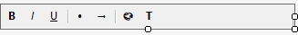

**Fichier** : `UI/UserControls_Referentiels/UC_RichTextToolbar.vb`

**Rôle** : Barre d'outils réutilisable pour formatage de notes enrichies.

**Description** :
UserControl autonome fournissant une toolbar standard pour manipuler un RichTextBox. Utilisé par tous les UC ayant des champs de notes enrichies (Éditeurs, Impression, Recommandations, PrixLit).

**Fonctionnalités** :

- Gras, Italique, Souligné, Couleurs, Taille police
- Liste à puces
- Tabulation
- Synchronisation automatique avec RichTextBox cible

**Architecture** :
Le UC expose une propriété `TargetRichTextBox` permettant de lier la toolbar à n'importe quel RichTextBox.

**Contrôles** :

| Contrôle       | Rôle                     | Type         |
| -------------- | ------------------------ | ------------ |
| `tls`          | ToolStrip                | ToolStrip    |
| `btnBold`      | Gras                     | ToolStripButton |
| `btnItalic`    | Italique                 | ToolStripButton |
| `btnUnderline` | Souligné                 | ToolStripButton |
| `btnBullet`    | Liste à puces            | ToolStripButton |
| `btnTab`       | Tabulation               | ToolStripButton |
| `btnColor` | Couleur police | ToolStripButton |
| `btnFontSize` | taille police | ToolStripButton |

**Propriété** :
```vb
Public Property TargetRichTextBox As RichTextBox
```

**Usage** :

```vb
' Dans UC parent
Dim toolbar As New UC_RichTextToolbar()
toolbar.TargetRichTextBox = rtbNotes
pnlToolbar.Controls.Add(toolbar)
```

**Modules liés** :
- `RichTextNotesHelper` : Toutes les actions de formatage sont déléguées au helper

**Méthodes principales** :
- `btnBold_Click()` : Appelle `RichTextNotesHelper.ToggleBold(TargetRichTextBox)`
- `btnItalic_Click()` : Appelle `RichTextNotesHelper.ToggleItalic(TargetRichTextBox)`
- `btnUnderline_Click()` : Appelle `RichTextNotesHelper.ToggleUnderline(TargetRichTextBox)`
- `btnBullet_Click()` : Appelle `RichTextNotesHelper.ToggleBulletList(TargetRichTextBox)`
- `btnTab_Click()` : Appelle `RichTextNotesHelper.InsertTab(TargetRichTextBox)`
- `btnColor_Click()` : Appelle `RichTextNotesHelper.SelectionColor(TargetRichTextBox)`
- `btnFontSize_Click()` : Appelle `RichTextNotesHelper.SelectionFont(TargetRichTextBox)`

**Règles** :

- La toolbar ne manipule **jamais** directement le RTF
- Toutes les opérations passent par `RichTextNotesHelper`
- Réutilisable dans n'importe quel contexte

---

## 6. Checklist création UC

### 6.1 Checklist complète

1. **Créer la classe métier** `Xxx` dans `Classes/Referentiels`
2. **Ajouter les requêtes SQL** `Xxx_*` dans `QueryModule.<Domaine>.vb`
3. **Ajouter les méthodes CRUD** `Xxx_*` dans `GestionReferentiel.<Domaine>.vb`
4. **Créer l'UC** `UC_Xxx` avec structure standard :
   - `pnlTop` (titre + navigation)
   - `pnlSearch` (recherche)
   - `tlpMain` (TableLayoutPanel liste + détails)
   - `pnlActions` (boutons)
5. **Implémenter** `IContextAwareUserControl`
6. **Recevoir contexte** via `SetContext(context)`
7. **Configurer grilles** avec `ConfigurerStyleGrid(dgv)`
8. **Gérer 3 modes** : Consultation, Nouveau, Modification
9. **Utiliser** `ConfigurerBoutonsMode` pour états boutons
10. **Valider** avec `ValidateRequiredField`
11. **Implémenter** `SelectionChanged` + `BindSelectedToDetails()`
12. **Ajouter l'UC** dans `PortailReferentiels` avec bouton navigation
13. **Mettre à jour** `Rules.md`, `Process_Artefact.md` et `CHANGELOG.md`
14. **Tester** : Consultation, Nouveau, Modification, Suppression, Recherche

### 6.2 Checklist UC hiérarchique (2-3 niveaux)

En plus de la checklist standard :

15. **Créer plusieurs DataGridView** (un par niveau)
16. **Créer plusieurs jeux de boutons** (un par niveau)
17. **Implémenter plusieurs méthodes SetMode** (une par niveau)
18. **Gérer dépendances** : Bouton "Nouveau enfant" désactivé si aucun parent sélectionné
19. **Utiliser** `ConfigurerBoutonsMode` avec paramètre `btnNewChild`
20. **Implémenter filtrage** par niveau parent (ComboBox ou chargement automatique)

---

## 7. Règles clés

### 7.1 Séparation des responsabilités

- **Aucune requête SQL dans les UC**
- Toute donnée passe par `GestionReferentiel`
- Toute requête passe par `QueryModule`
- Toute suppression vérifie les dépendances

### 7.2 UI standardisée

- **DataGridView** : `ConfigurerStyleGrid`, masquage colonnes techniques
- **Boutons** : `ConfigurerBoutonsMode` pour gestion états
- **Validation** : `ErrorProvider` (partagé) + `ValidateRequiredField`
- **Messages** : `StatusStrip` (partagé) pour feedback utilisateur

### 7.3 Notes enrichies

- **Stockage dual** : `_rtf` + `_txt`
- **Affichage** : uniquement `_rtf`
- **Recherche SQL** : uniquement `_txt`
- **Manipulation** : obligatoirement via `RichTextNotesHelper`

### 7.4 Modes d'édition

- **Consultation** : Navigation libre, champs désactivés
- **Nouveau** : Champs vides actifs, snapshot = Nothing
- **Modification** : Snapshot pour annulation, champs actifs

### 7.5 ComboBox

- **Séparation stricte** : Filtre UI ≠ Champ métier
- Valeurs sentinelles (0, -1, "Toutes") interdites en base
- Utiliser ComboBox distinctes si double usage nécessaire

### 7.6 Synchronisation DataGridView

- **Toujours utiliser** `CurrentRow` (pas `SelectedRows(0)`)
- **Événement obligatoire** : `SelectionChanged` → `BindSelectedToDetails()`
- **Condition** : Uniquement en mode Consultation

### 7.7 Contexte partagé

- **Tous les UC** implémentent `IContextAwareUserControl`
- **ToolTip**, **ErrorProvider**, **StatusStrip** : fournis par contexte
- **NavigationManager** : gestion fil d'Ariane centralisée

### 7.8 Helpers partagés

- **UtilsUCReferentiels** : fonctions communes à tous les UC
- **RichTextNotesHelper** : gestion notes enrichies
- **Factorisation** : minimum 2 usages pour justifier helper

---

**Fin de la documentation technique UI**

**Version : Mars 2026**
**Dernière mise à jour : Migration complète vers architecture UC + contexte partagé**
