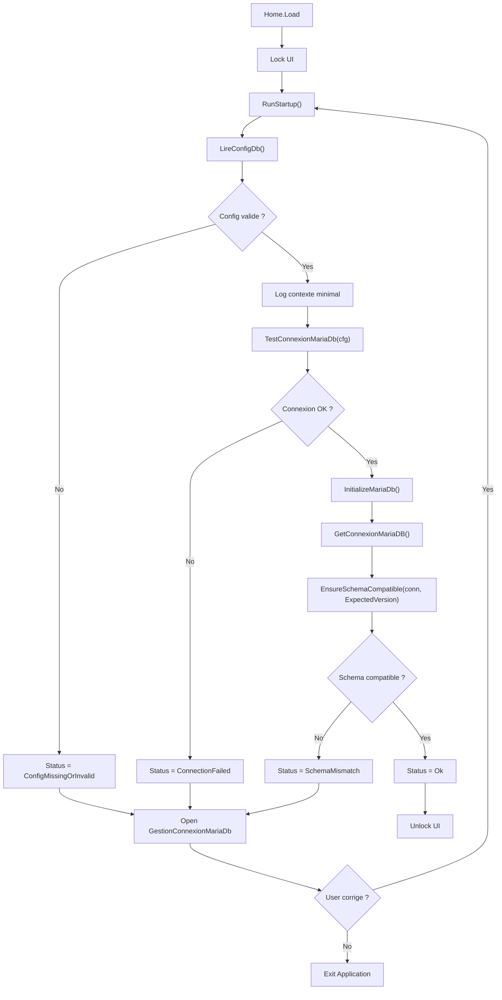
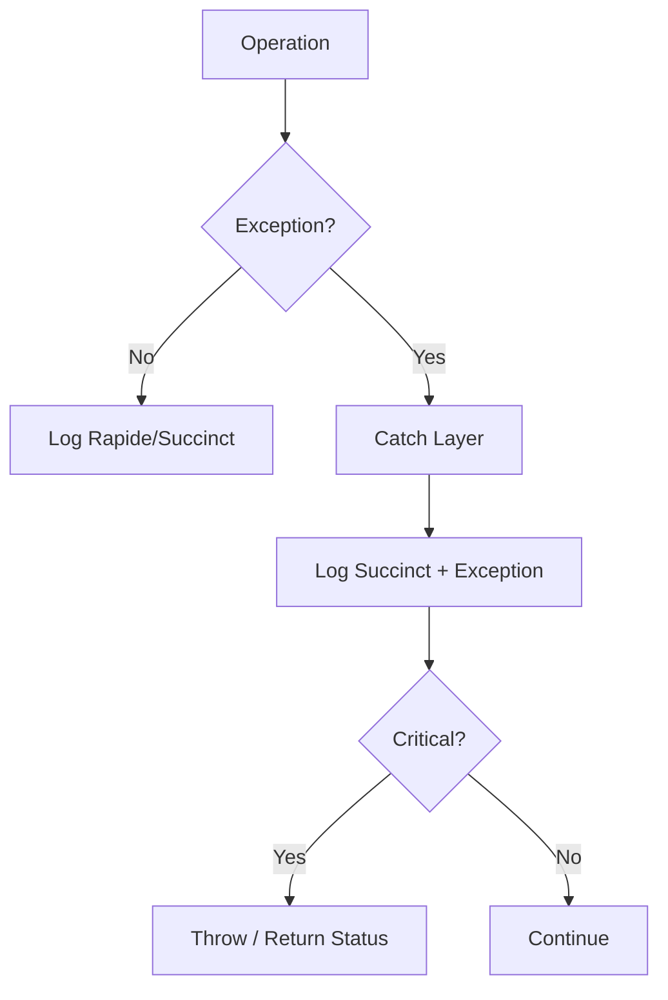
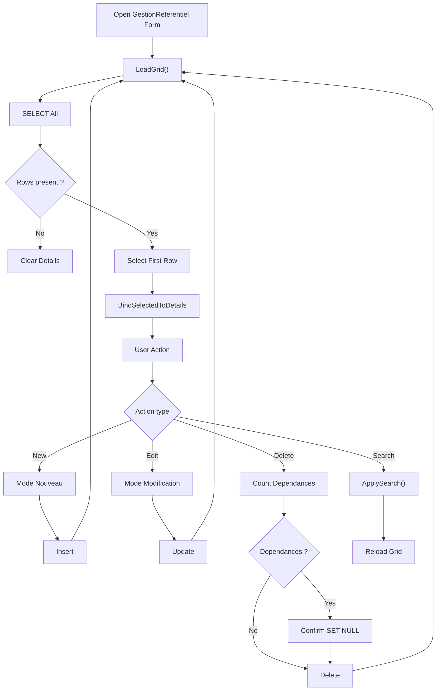
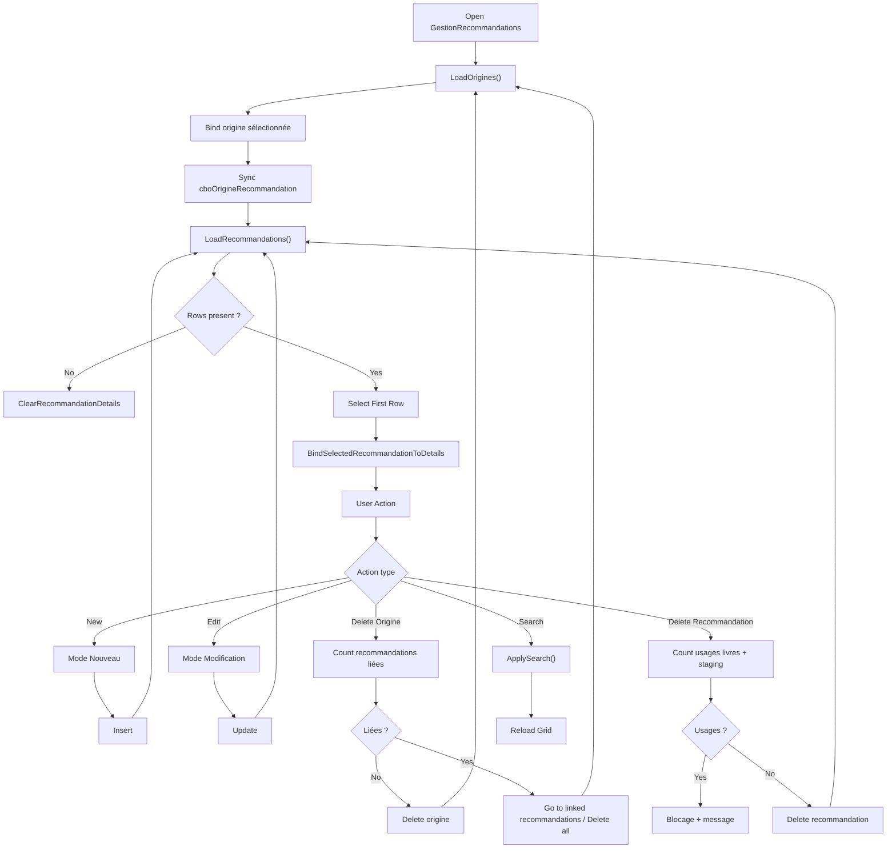
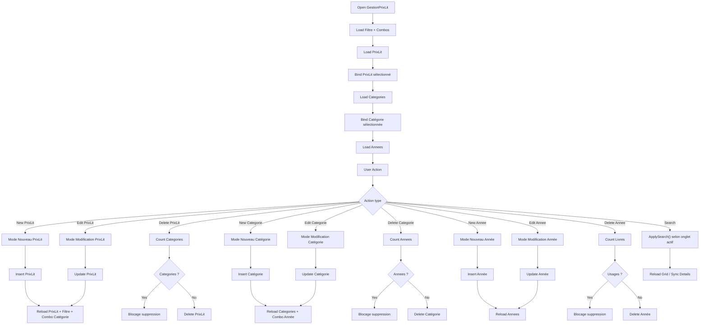

# 📌 Processus 01 – Démarrage & Connexion MariaDB

## 🎯 Objectif

Garantir qu’Artefact ne démarre jamais sans :

- Une configuration locale valide
- Une connexion MariaDB opérationnelle
- Une version de schéma compatible (`meta_schema`)

Le démarrage est bloquant : sans DB valide, l’application ne peut pas fonctionner.

---

## 🧭 Vue d’ensemble du flow

1. Home.Load déclenche `RunStartupFlow()`
2. UI verrouillée
3. AppStartupManager.RunStartup()
   - Lecture config JSON
   - Test connexion DB
   - Vérification version schéma
4. Si KO → ouverture GestionConnexionMariaDb
5. Re-test en boucle jusqu’à OK ou abandon utilisateur
6. Déverrouillage UI si succès

---

## 🧩 Étapes détaillées

### 1️⃣ Lecture configuration locale

- Fichier : `%APPDATA%\Artefact\artefact.local.json`
- Contient : Host, Port, Database, UserName, PasswordEncB64, OptionsConn
- Mot de passe chiffré via DPAPI (CurrentUser)

**Contraintes :**
- Aucun secret loggué
- Retour `ConfigMissingOrInvalid` si absent ou illisible

---

### 2️⃣ Test connexion MariaDB

- Construction centralisée de la connection string
- Déchiffrement DPAPI sécurisé
- Connexion testée via `DatabaseManager.TestConnexionMariaDb`

**Contraintes :**
- Aucun log de la connection string complète
- En cas d’échec : statut `ConnectionFailed`

---

### 3️⃣ Vérification version schéma

- Lecture de la table `meta_schema`
- Comparaison avec `ExpectedSchemaVersion`
- Mismatch déclenche `SchemaMismatch`

**Contraintes :**
- La version concerne Artefact (pas MariaDB)
- Toute migration structurelle impose incrémentation

---

### 4️⃣ Correction via UI

Si échec :

- Ouverture de `GestionConnexionMariaDb`
- Test obligatoire avant enregistrement
- Boucle jusqu’à succès ou annulation

---

### 5️⃣ Déverrouillage

Si statut `Ok` :

- UI déverrouillée
- StatusStrip mis à jour
- Application pleinement opérationnelle

---

## 🔐 Principes fondamentaux

- Aucune MsgBox dans AppStartupManager
- Tous les détails techniques passent par GestionLog
- Home est responsable de l’UI
- StartupManager est responsable de l’orchestration
- DatabaseManager est responsable des accès DB

---

## 🚫 Cas critiques

- Abandon utilisateur → fermeture contrôlée de l’application
- Erreur inattendue → log + fermeture

---

## 📊 Flowchart – Processus 01 (Startup)



---
---

# 📌 Processus 02 – Gestion des erreurs & Logs

## 🎯 Objectif

Garantir :

- Traçabilité complète
- Aucune fuite de secret
- Diagnostic possible en production
- Séparation claire responsabilités / UI

---

## 🧭 Architecture du logging

Module central : `GestionLog`

- Fichier journalier :
  `%APPDATA%\Artefact\Logs\Artefact_YYYY-MM-DD.log`
- Purge automatique > 7 jours
- Header session au premier log
- Thread-safe (SyncLock)

---

## 📊 Niveaux de log

| Niveau     | Usage |
|------------|--------|
| Rapide     | Étapes majeures |
| Succinct   | Erreurs / informations importantes |
| Complet    | Détails techniques (stack, inner) |

⚠️ Pas de filtre global.  
Le niveau est un marqueur de profondeur, pas un mécanisme de réduction.

---

## 🏷 Catégories

- General
- Startup
- Database
- UI
- Process

Permet lecture ciblée des logs.

---

## 🔁 Flow de gestion d’erreur

### 1️⃣ Couche basse (Crypto, IO)

- Throw exception explicite
- Aucun log direct

### 2️⃣ Couche intermédiaire (DatabaseManager)

- Catch technique
- Log Succinct + ex
- Throw si critique

### 3️⃣ Orchestrateur (AppStartupManager)

- Catch métier
- Log structuré
- Retourne un statut

### 4️⃣ UI

- Affiche message seulement si blocage
- Ne masque jamais une erreur critique

---

## 🔐 Protection des secrets

- Masquage automatique `Password=` / `Pwd=`
- Aucune connection string complète logguée
- Mot de passe jamais affiché sauf action volontaire

---

## 🧠 Principes clés

- Une erreur non logguée est un bug
- Un secret loggué est une faute grave
- Une MsgBox n’est jamais un mécanisme de gestion d’erreur
- Les exceptions doivent être explicites et enrichies

---

## 📊 Flowchart – Processus 02 (Erreur & Log)



---

# 📌 Processus 03 – Gestion des Référentiels (Phase 1)

## 🎯 Objectif

Fournir un mécanisme standardisé, fiable et réutilisable pour la gestion des tables référentielles dans Artefact.

Les référentiels constituent les données structurantes du système :
ils définissent les valeurs utilisées par les tables métier (livres, staging, fichiers, etc.).

###### Exemples :

- Langues

- Editeurs

- FormatFile

- Impression

- Paramètres (prévu)

- Ce processus garantit :

- Une architecture cohérente

- Une séparation stricte des responsabilités

- Un comportement UI homogène

- Une gestion sécurisée des suppressions et dépendances


## 🧭 Architecture du processus

La gestion d’un référentiel repose sur trois couches clairement séparées.

```
`Form UI`
   `↓`
`GestionReferentiel`
   `↓`
`QueryModule`
   `↓`
`MariaDB`
```

### 1️⃣ QueryModule

Responsable **uniquement du SQL.**

<u>Contient :</u>

- SELECT

- INSERT

- UPDATE

- DELETE

- COUNT dépendances


**Aucune exécution SQL** n’est autorisée dans ce module.

<u>Structure :</u>

```
Region "TABLE - SQL"
```

<u>Exemples :</u>

```
Editeurs_SelectAll
Editeurs_SelectBySearch
Editeurs_Insert
Editeurs_Update
Editeurs_Delete
Editeurs_CountLivres
```

### 2️⃣ GestionReferentiel

Module d’accès aux données.

<u>Responsabilités :</u>

- Exécuter les requêtes SQL

- Gérer les connexions MariaDB

- Logger les erreurs

- Remonter les exceptions


<u>Connexion obtenue via :</u>

```
DatabaseManager.GetConnexionMariaDB()
```

**Chaque table** possède sa région :

```
Region "TABLE - CRUD"
```

### 3️⃣ Formulaire de gestion

Chaque référentiel possède un formulaire dédié :

```
GestionLangues
GestionEditeurs
GestionFormatFile
GestionImpression
```

**La Form :**

- ne contient aucun SQL

- appelle uniquement GestionReferentiel


<u>Elle gère :</u>

- l’interface utilisateur

- la validation

- la synchronisation Grid / détails

- la logique CRUD


## 🧩 Structure standard d’une Form référentielle

Chaque Form suit strictement la même organisation.

1. Déclarations
2. Initialisation
3. Gestion des modes
4. Interface utilisateur
5. Actions utilisateur (CRUD)
6. Synchronisation des données
7. Validation
8. Recherche

<u>Ordre obligatoire</u> :

Déclaration → Init → Modes → UI → Actions → Données → Validation → Recherche

### ⚙️ Variables communes

Chaque Form contient :

```
_mode       As ModeEdition
_snapshot   As Object métier
_currentId  As ULong
```

Modes possibles :

```
Consultation
Nouveau
Modification
```

### 🔄 Synchronisation Grid / Détails

La **DataGridView** affiche les données du référentiel.

Lorsqu’une ligne est sélectionnée :

```
SelectionChanged
```

déclenche la synchronisation vers les champs détails.

Cette synchronisation **est active uniquement en mode Consultation.**

```
If _mode <> ModeEdition.Consultation Then Exit Sub
```

### ✏️ Processus CRUD

#### Création

1. bouton New

2. passage en mode Nouveau

3. champs vidés

4. saisie utilisateur

5. validation

6. Insert

7. rechargement de la grille


#### Modification

1. sélection dans la grille

2. bouton Edit

3. création d’un snapshot

4. passage en mode Modification

5. validation

6. Update

7. rechargement grille


#### Annulation

*Deux cas :*

- **Nouveau**

Retour à la ligne sélectionnée.

- **Modification**

Restauration du snapshot.

#### Suppression

1. vérification de la sélection

2. comptage des dépendances

3. message utilisateur

4. suppression

5. rechargement de la grille


Les clés étrangères utilisent généralement :

```
ON DELETE SET NULL
```

afin de permettre la suppression sans casser l’intégrité.

#### 🔍 Recherche

Chaque référentiel propose une recherche simple.

**Fonctionnement :**

```
txtSearch
btnSearch
btnClearSearch
```

**Deux requêtes possibles :**

```
SelectBySearch
SelectBySearchIncludingNotes
```

La seconde inclut les champs notes lorsque l’option est cochée.

#### 📝 Gestion des notes

Certaines tables possèdent un champ notes.

###### UI :

```
RichTextBox
Scrollbars verticales
```

###### Objectif futur :

*support de texte enrichi :*

- gras

- italique

- souligné

- listes

- tabulations


*Stockage prévu :*

```
RTF + texte brut miroir
```

pour permettre la recherche.

#### 🔐 Gestion des suppressions

La suppression d’une valeur référentielle doit vérifier les dépendances.

*Principe :*

```
CountDependances()
```

*Exemples :*

```
FormatFile_CountLivresFichiers
Editeurs_CountLivres
Impression_CountLivres
```

Si dépendances présentes :

message utilisateur

suppression autorisée uniquement si les FK sont SET NULL

#### ⚠️ Règle critique

Si une nouvelle table référence un référentiel,
le système de suppression doit être mis à jour.

*Exemple* :

Si `ref_enum` est utilisé par une nouvelle table :

```
nouvelle_table.id_enum
```

alors la fonction :

RefEnum_CountDependances()

doit être adaptée.

**Cette règle garantit la cohérence globale du système.**

## 🧠 Principes fondamentaux

- Une Form ne doit **jamais contenir de SQL**
- QueryModule ne doit **jamais exécuter de requêtes**
- GestionReferentiel est l’unique accès à la base
- Toute erreur DB doit être **logguée**
- Toute suppression doit vérifier les dépendances
- Les référentiels doivent rester **simples et stables**

## 📊 Flowchart – Processus 03 (Référentiels)



---

# 📌 Processus 04 – Gestion des recommandations

## 🎯 Objectif

Permettre de **capturer, structurer et exploiter les recommandations de livres**, indépendamment de leur état dans le système.

Une recommandation =
 👉 un **événement de découverte** (quelqu’un parle d’un livre quelque part).

------

## 🧩 Principe général

Le système repose sur une séparation claire :

1. **Origine** → d’où vient la recommandation
2. **Recommandation** → l’événement lui-même
3. **Association** → lien vers un livre (plus tard ou immédiatement)

------

## 🧠 Fonctionnement métier

### 1️⃣ Gestion des origines

On maintient un référentiel des sources :

- TikTok
- Blog
- Ami
- Libraire
- etc.

👉 C’est un simple catalogue de “canaux de découverte”.

------

### 2️⃣ Gestion des recommandations

Une recommandation est un enregistrement contenant :

- une origine
- éventuellement un nom / pseudo
- une URL
- une date
- un commentaire

👉 Elle peut exister **sans être liée à un livre**.

C’est important :
 on peut capter une info même si le livre n’est pas encore intégré.

------

### 3️⃣ Association aux livres

Une recommandation peut ensuite être liée :

- à un livre validé (`livres`)
- ou à un livre en cours (`livres_staging`)

👉 via des tables de liaison 

------

## 🔗 Logique globale

- Un livre peut avoir **plusieurs recommandations**
- Une recommandation appartient à **une seule origine**
- Les recommandations sont **indépendantes du cycle de vie du livre**

👉 On sépare clairement :

- la découverte
- la donnée livre

------

## 🔍 Recherche

La recherche permet :

- filtrer par origine ou globalement
- chercher dans les infos de source
- inclure ou non les commentaires

👉 utile pour retrouver :
 “où ai-je vu ce livre déjà ?”

------

## 🔐 Suppression (logique)

- Une origine **avec recommandations** → suppression contrôlée
- Une recommandation **liée à des livres** → suppression bloquée

👉 objectif : ne jamais casser les liens existants

------

## 🧠 Résumé mental

👉 Une recommandation = **trace d’un moment où un livre a croisé ton radar**

## 📊 Flowchart – Processus 04 (Recommandations)



---

# 📌 Processus 05 – Gestion des prix littéraires (Phase 2)

## 🎯 Objectif

Permettre de **structurer les prix littéraires** de manière exploitable et évolutive.

On ne stocke pas juste “Prix Goncourt”
 👉 on stocke **qui, quoi, quand, dans quel contexte**

------

## 🧩 Principe général

Le système repose sur une hiérarchie à 3 niveaux :

1. **Prix** (Goncourt, Hugo…)
2. **Catégorie** (roman, polar…)
3. **Année** (2024, 2025…)

------

## 🧠 Fonctionnement métier

### 1️⃣ Gestion des prix

Référentiel des prix :

- Prix Goncourt
- Prix Hugo
- Prix Nebula

👉 ce sont des “entités principales”

------

### 2️⃣ Gestion des catégories

Chaque prix peut avoir plusieurs catégories :

- meilleur roman
- meilleur polar
- meilleur auteur

👉 une catégorie appartient **toujours à un prix**

------

### 3️⃣ Gestion des années

Chaque catégorie peut exister pour plusieurs années :

- Polar 2024
- Polar 2025
- Fantastique 2024

👉 c’est là que ça devient exploitable

------

### 4️⃣ Association aux livres

On associe ensuite un livre à :

👉 **une année précise d’une catégorie**

Exemple :

- Livre X → Polar 2024

👉 via une table de liaison 

------

## 🔗 Logique globale

- Un prix → plusieurs catégories
- Une catégorie → plusieurs années
- Une année → plusieurs livres possibles

👉 structure souple et réaliste

------

## 🧠 Point clé de design

On ne relie **jamais directement une année à un prix**

👉 le lien passe par la catégorie

C’est volontaire :

- évite les incohérences
- permet des structures complexes
- rend le modèle extensible

------

## 🔍 Recherche

Recherche locale selon le niveau :

- prix → nom / description
- catégories → libellé
- années → année

👉 toujours dans le contexte courant

------

## 🔐 Suppression (logique)

- Prix avec catégories → suppression bloquée
- Catégorie avec années → suppression bloquée
- Année utilisée par des livres → suppression bloquée

👉 logique stricte, pas de casse de données

------

## 🧠 Résumé mental

👉 Un prix littéraire =
 **une structure hiérarchique qui devient exploitable uniquement au niveau “année”**

## 📊 Flowchart – Processus 05 (Prix littéraires)




---
---

> **Contact** : ***Joëlle (Manou)  - Les Artefacts de Manou***
>
> Projet personnel, expérimental, réalisé pour le fun, le test et l'étude de connaissances techniques.
> mailto: `joelle@nguyen.eu`
>
> - GitHub privé : Artefact    https://github.com/AngeljoNG/Artefact
> - GitHub public : Artefact  https://github.com/Les-Artefacts-de-Manou/Artefact
>

---
---

[TOC]

