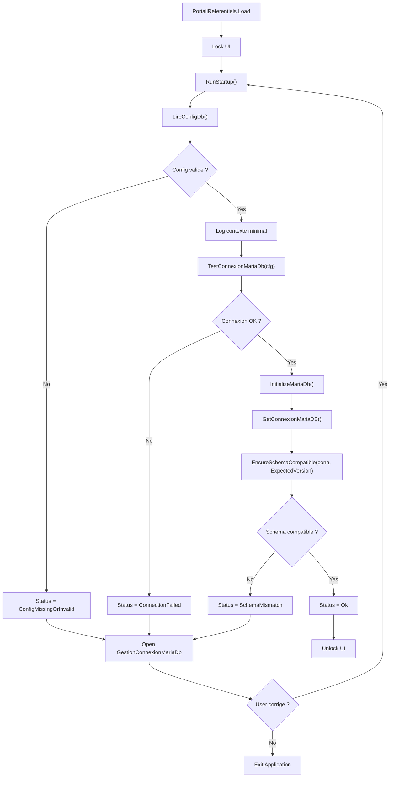
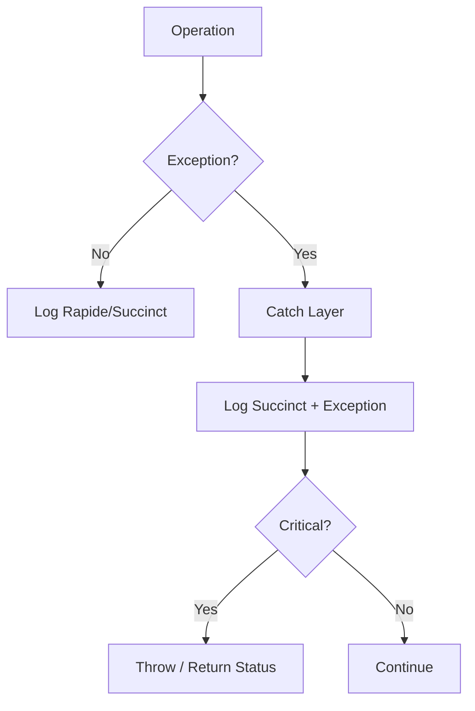
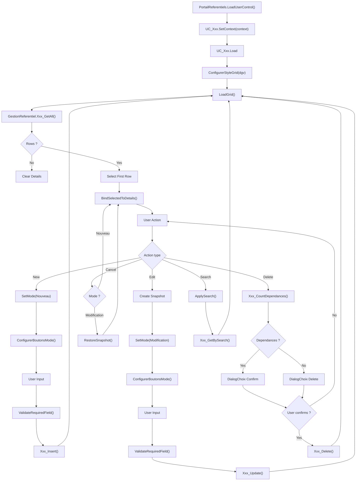
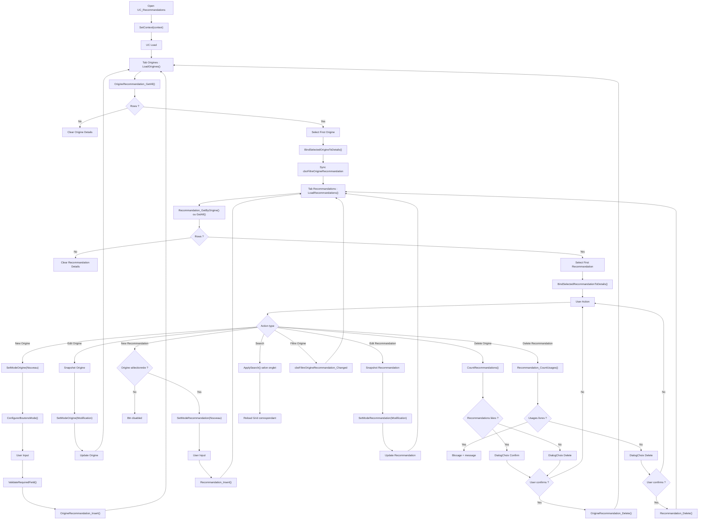
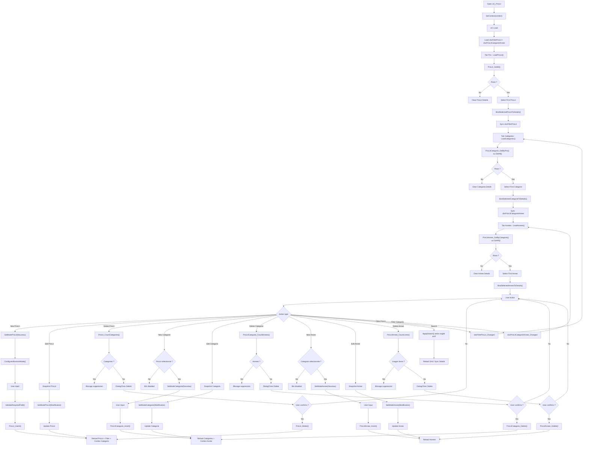
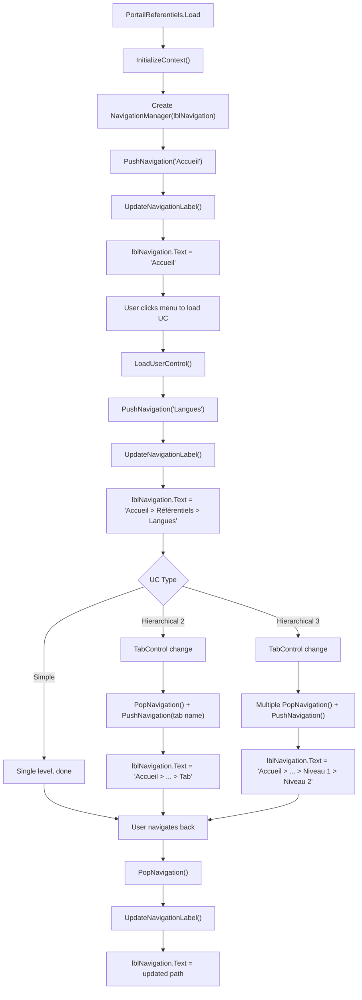

# Processus Artefact

## Table des matières

1. [Processus 01 - Démarrage & Connexion MariaDB](#processus-01)
2. [Processus 02 - Gestion des erreurs & Logs](#processus-02)
3. [Processus 03 - Gestion des Référentiels (Architecture UC)](#processus-03)
4. [Processus 04 - Gestion des Recommandations (UC hiérarchique)](#processus-04)
5. [Processus 05 - Gestion des Prix Littéraires (UC hiérarchique 3 niveaux)](#processus-05)
6. [Processus 06 - Gestion du Contexte Partagé](#processus-06)
7. [Processus 07 - Gestion de la Navigation](#processus-07)
8. [Processus 08 - Import Calibre (à venir)](#processus-08)

---

# Processus 01 – Démarrage & Connexion MariaDB

## Objectif

Garantir qu'Artefact ne démarre jamais sans :

- Une configuration locale valide
- Une connexion MariaDB opérationnelle
- Une version de schéma compatible (`meta_schema`)

Le démarrage est bloquant : sans DB valide, l'application ne peut pas fonctionner.

---

## Vue d'ensemble du flow

1. PortailReferentiels.Load déclenche `RunStartupFlow()`
2. UI verrouillée
3. AppStartupManager.RunStartup()
   - Lecture config JSON
   - Test connexion DB
   - Vérification version schéma
4. Si KO → ouverture GestionConnexionMariaDb
5. Re-test en boucle jusqu'à OK ou abandon utilisateur
6. Déverrouillage UI si succès

---

## Étapes détaillées

### 1. Lecture configuration locale

- Fichier : `%APPDATA%\Artefact\artefact.local.json`
- Contient : Host, Port, Database, UserName, PasswordEncB64, OptionsConn
- Mot de passe chiffré via DPAPI (CurrentUser)

**Contraintes :**
- Aucun secret loggué
- Retour `ConfigMissingOrInvalid` si absent ou illisible

---

### 2. Test connexion MariaDB

- Construction centralisée de la connection string
- Déchiffrement DPAPI sécurisé
- Connexion testée via `DatabaseManager.TestConnexionMariaDb`

**Contraintes :**
- Aucun log de la connection string complète
- En cas d'échec : statut `ConnectionFailed`

---

### 3. Vérification version schéma

- Lecture de la table `meta_schema`
- Comparaison avec `ExpectedSchemaVersion`
- Mismatch déclenche `SchemaMismatch`

**Contraintes :**
- La version concerne Artefact (pas MariaDB)
- Toute migration structurelle impose incrémentation

---

### 4. Correction via UI

Si échec :

- Ouverture de `GestionConnexionMariaDb`
- Test obligatoire avant enregistrement
- Boucle jusqu'à succès ou annulation

---

### 5. Déverrouillage

Si statut `Ok` :

- UI déverrouillée
- StatusStrip mis à jour
- Application pleinement opérationnelle

---

## Principes fondamentaux

- Aucune MsgBox dans AppStartupManager
- Tous les détails techniques passent par GestionLog
- PortailReferentiels est responsable de l'UI
- StartupManager est responsable de l'orchestration
- DatabaseManager est responsable des accès DB

---

## Cas critiques

- Abandon utilisateur → fermeture contrôlée de l'application
- Erreur inattendue → log + fermeture

---

## Flowchart – Processus 01 (Startup)



---
---

# Processus 02 – Gestion des erreurs & Logs

## Objectif

Garantir :

- Traçabilité complète
- Aucune fuite de secret
- Diagnostic possible en production
- Séparation claire responsabilités / UI

---

## Architecture du logging

Module central : `GestionLog`

- Fichier journalier :
  `%APPDATA%\Artefact\Logs\Artefact_YYYY-MM-DD.log`
- Purge automatique > 7 jours
- Header session au premier log
- Thread-safe (SyncLock)

---

## Niveaux de log

| Niveau     | Usage |
|------------|--------|
| Rapide     | Étapes majeures |
| Succinct   | Erreurs / informations importantes |
| Complet    | Détails techniques (stack, inner) |

Pas de filtre global.  
Le niveau est un marqueur de profondeur, pas un mécanisme de réduction.

---

## Catégories

- General
- Startup
- Database
- UI
- Process

Permet lecture ciblée des logs.

---

## Flow de gestion d'erreur

### 1. Couche basse (Crypto, IO)

- Throw exception explicite
- Aucun log direct

### 2. Couche intermédiaire (DatabaseManager)

- Catch technique
- Log Succinct + ex
- Throw si critique

### 3. Orchestrateur (AppStartupManager)

- Catch métier
- Log structuré
- Retourne un statut

### 4. UI

- Affiche message seulement si blocage
- Ne masque jamais une erreur critique

---

## Protection des secrets

- Masquage automatique `Password=` / `Pwd=`
- Aucune connection string complète logguée
- Mot de passe jamais affiché sauf action volontaire

---

## Principes clés

- Une erreur non logguée est un bug
- Un secret loggué est une faute grave
- Une MsgBox n'est jamais un mécanisme de gestion d'erreur
- Les exceptions doivent être explicites et enrichies

---

## Flowchart – Processus 02 (Erreur & Log)



---

# Processus 03 – Gestion des Référentiels (Architecture UC)

## Objectif

Fournir un mécanisme standardisé, fiable et réutilisable pour la gestion des tables référentielles dans Artefact via des **UserControls hébergés dans PortailReferentiels**.

Les référentiels constituent les données structurantes du système :
ils définissent les valeurs utilisées par les tables métier (livres, staging, fichiers, etc.).

**Exemples :**

- Langues, Pays
- Contacts, Editeurs
- FormatFile, Impression
- RefEnum (hiérarchique 2 niveaux)
- Recommandations (hiérarchique 2 niveaux)
- PrixLit (hiérarchique 3 niveaux)

**Ce processus garantit :**

- Une architecture cohérente basée sur UC + contexte partagé
- Une séparation stricte des responsabilités
- Un comportement UI homogène
- Une gestion sécurisée des suppressions et dépendances
- Une factorisation maximale via helpers partagés

---

## Architecture du processus

La gestion d'un référentiel repose sur **quatre couches** clairement séparées.

```
UserControl (UC_Xxx)
   ↓
GestionReferentiel (partialisé)
   ↓
QueryModule (partialisé)
   ↓
MariaDB
```

### 1. QueryModule (partialisé)

Responsable **uniquement du SQL.**

**Contient :**

- SELECT (All, BySearch, ByParent...)
- INSERT
- UPDATE
- DELETE
- COUNT dépendances

**Aucune exécution SQL** n'est autorisée dans ce module.

**Structure :**

```vb
' QueryModule.ContactsEditeurs.vb
Partial Module QueryModule
	Region "CONTACTS - SQL"
	Public Const Contact_SelectAll As String = "..."
	Public Const Contact_Insert As String = "..."
	End Region
End Module
```

**Exemples :**

- `QueryModule.Langues.vb` : Langue_SelectAll, Langue_Insert...
- `QueryModule.RefEnum.vb` : RefEnumType_SelectAll, RefEnum_SelectByType...
- `QueryModule.PrixLit.vb` : PrixLit_SelectAll, PrixLitCategorie_SelectByPrix...

---

### 2. GestionReferentiel (partialisé)

Module d'accès aux données.

**Responsabilités :**

- Exécuter les requêtes SQL
- Gérer les connexions MariaDB
- Logger les erreurs
- Remonter les exceptions

**Connexion obtenue via :**

```vb
DatabaseManager.GetConnexionMariaDB()
```

**Structure :**

```vb
' GestionReferentiel.ContactsEditeurs.vb
Partial Module GestionReferentiel
	Region "CONTACTS - CRUD"
	Public Function Contact_GetAll() As DataTable
	Public Function Contact_Insert(contact As Contact) As Boolean
	End Region
End Module
```

**Chaque domaine** possède son fichier partiel :

- `GestionReferentiel.Langues.vb`
- `GestionReferentiel.RefEnum.vb`
- `GestionReferentiel.Recommandations.vb`
- etc.

---

### 3. UtilsUCReferentiels (helpers partagés)

Module de helpers **réutilisables par tous les UC**.

**Fonctions principales :**

- `ConfigurerStyleGrid(dgv)` : Style DataGridView uniforme
- `ConfigurerBoutonsMode(mode, btnNew, btnEdit, btnSave, btnCancel, btnDelete, Optional btnNewChild)` : Gestion états boutons
- `ConfigurerRecherche(txtSearch, btnSearch, btnClear)` : Configuration zone de recherche
- `ValidateRequiredField(errProvider, control, fieldName, value)` : Validation champs requis
- `HideTechnicalColumns(dgv)` : Masquage colonnes ID/codes
- `GetStringValue(row, columnName)`, `GetBoolValue()`, `GetIntValue()` : Extraction sécurisée

**Objectif :**

Factoriser le code commun et garantir un comportement homogène entre tous les UC référentiels.

---

### 4. UserControl (UC_Xxx)

Chaque référentiel possède un **UserControl hébergé** dans `PortailReferentiels` :

```
UC_Langues
UC_Editeurs
UC_Impression
UC_RefEnum (hiérarchique 2 niveaux)
UC_Recommandations (hiérarchique 2 niveaux)
UC_PrixLit (hiérarchique 3 niveaux)
```

**L'UC :**

- **Ne contient aucun SQL**
- Appelle uniquement `GestionReferentiel`
- Implémente obligatoirement `IContextAwareUserControl`
- Reçoit le contexte partagé via `SetContext(context)`
- Utilise les helpers de `UtilsUCReferentiels`

**Gère :**

- L'interface utilisateur
- La validation via `ErrorProvider` (partagé)
- La synchronisation Grid / détails
- Les 3 modes d'édition (Consultation, Nouveau, Modification)

---

## Structure standard d'un UC référentiel

Chaque UC suit strictement la même organisation.

**Sections obligatoires :**

1. **Déclarations** (variables privées)
2. **Implémentation IContextAwareUserControl**
3. **Initialisation** (Load, SetContext)
4. **Gestion des modes** (SetMode)
5. **Actions utilisateur** (CRUD via boutons)
6. **Synchronisation Grid → Détails** (SelectionChanged)
7. **Validation** (ValidateXxx)
8. **Recherche** (Search, ClearSearch)

---

### Variables communes

Chaque UC contient :

```vb
Private _context As UserControlContext
Private _mode As ModeEdition
Private _snapshot As <ClasseMetier>
Private _currentId As ULong
```

**Modes possibles** (`UtilsForm.ModeEdition`) :

- `Consultation` : Navigation libre, champs désactivés
- `Nouveau` : Champs vides actifs, snapshot = Nothing
- `Modification` : Snapshot pour annulation, champs actifs

---

### Synchronisation Grid / Détails

La **DataGridView** affiche les données du référentiel.

Lorsqu'une ligne est sélectionnée, l'événement `SelectionChanged` déclenche la synchronisation vers les champs de détails.

**Règle critique :**

Cette synchronisation **est active uniquement en mode Consultation.**

```vb
Private Sub dgv_SelectionChanged(sender As Object, e As EventArgs) Handles dgv.SelectionChanged
	If _mode <> ModeEdition.Consultation Then Exit Sub
	BindSelectedToDetails()
End Sub
```

**Fonction de binding :**

```vb
Private Sub BindSelectedToDetails()
	If dgv.CurrentRow Is Nothing Then Exit Sub
	Dim row = dgv.CurrentRow

	_currentId = UtilsUCReferentiels.GetULongValue(row, "id_xxx")
	txtNom.Text = UtilsUCReferentiels.GetStringValue(row, "nom_xxx")
	chkActif.Checked = UtilsUCReferentiels.GetBoolValue(row, "is_actif")
	' etc.
End Sub
```

---

### Processus CRUD

#### Création (Nouveau)

1. Clic sur `btnNew`
2. Appel `SetMode(ModeEdition.Nouveau)`
3. Champs vidés et activés
4. Saisie utilisateur
5. Clic sur `btnSave`
6. Validation via `ValidateRequiredField`
7. Appel `GestionReferentiel.Xxx_Insert()`
8. Rechargement de la grille
9. Retour en mode Consultation

#### Modification

1. Sélection dans la grille
2. Clic sur `btnEdit`
3. **Création d'un snapshot** (copie profonde de l'objet)
4. Appel `SetMode(ModeEdition.Modification)`
5. Champs activés
6. Modification utilisateur
7. Clic sur `btnSave`
8. Validation
9. Appel `GestionReferentiel.Xxx_Update()`
10. Rechargement grille
11. Retour en mode Consultation

#### Annulation

**Deux comportements selon le mode :**

- **Mode Nouveau** : Retour à la ligne précédemment sélectionnée (ou première ligne)
- **Mode Modification** : Restauration du snapshot dans les champs UI

```vb
Private Sub btnCancel_Click(sender As Object, e As EventArgs) Handles btnCancel.Click
	If _mode = ModeEdition.Modification AndAlso _snapshot IsNot Nothing Then
		RestoreSnapshot()
	End If
	SetMode(ModeEdition.Consultation)
	BindSelectedToDetails()
End Sub
```

#### Suppression

1. Vérification de la sélection
2. **Comptage des dépendances** via `GestionReferentiel.Xxx_CountDependances()`
3. Message utilisateur via `DialogChoix` si dépendances présentes
4. Confirmation utilisateur
5. Appel `GestionReferentiel.Xxx_Delete()`
6. Rechargement de la grille

**Règle FK :**

Les clés étrangères utilisent généralement `ON DELETE SET NULL` pour permettre la suppression sans casser l'intégrité.

---

### Recherche

Chaque référentiel propose une recherche simple.

**Contrôles :**

```vb
txtSearch       ' Zone de saisie
btnSearch       ' Lancer recherche
btnClearSearch  ' Effacer recherche
chkSearchNotes  ' Inclure recherche dans notes (optionnel)
```

**Configuration via helper :**

```vb
UtilsUCReferentiels.ConfigurerRecherche(txtSearch, btnSearch, btnClearSearch)
```

**Requêtes disponibles :**

- `Xxx_SelectBySearch` : Recherche dans nom/libellé
- `Xxx_SelectBySearchIncludingNotes` : Recherche incluant champs notes

**Événements :**

```vb
Private Sub btnSearch_Click(sender As Object, e As EventArgs) Handles btnSearch.Click
	ApplySearch()
End Sub

Private Sub btnClearSearch_Click(sender As Object, e As EventArgs) Handles btnClearSearch.Click
	txtSearch.Clear()
	LoadGrid()
End Sub
```

---

### Gestion des notes enrichies

Certaines tables possèdent des champs notes formatés.

**UI :**

```vb
RichTextBox avec scrollbars verticales
UC_RichTextToolbar pour formatage
```

**Stockage dual obligatoire :**

- `xxx_rtf` : Contenu formaté (affichage UI)
- `xxx_txt` : Texte brut (recherche SQL)

**Manipulation via `RichTextNotesHelper` :**

```vb
' Initialisation
RichTextNotesHelper.InitializeRichTextBox(rtbNotes)

' Chargement
RichTextNotesHelper.LoadRtfContent(rtbNotes, rtfFromDb)

' Sauvegarde
Dim rtfContent = RichTextNotesHelper.GetRtfContent(rtbNotes)
Dim txtContent = RichTextNotesHelper.GetPlainText(rtbNotes)
```

**Règles critiques :**

- Le RTF n'est **jamais** utilisé pour les recherches SQL
- Le texte brut n'est **jamais** utilisé pour l'affichage riche
- Toute manipulation passe par le helper (pas de manipulation directe du RTF)

---

### Gestion des suppressions

La suppression d'une valeur référentielle **doit toujours vérifier les dépendances.**

**Principe :**

```vb
Dim count As Integer = GestionReferentiel.Xxx_CountDependances(_currentId)

If count > 0 Then
	Dim dialog As New DialogChoix(
		"Suppression",
		$"Cet élément est utilisé {count} fois. Supprimer quand même ?",
		showCancel:=True,
		icon:=DialogIcon.Warning
	)
	If dialog.ShowDialog() <> DialogResult.Yes Then Exit Sub
End If
```

**Exemples :**

- `FormatFile_CountLivresFichiers` : Compte usages dans `livres_fichiers`
- `Editeur_CountLivres` : Compte usages dans `livres`
- `PrixLitAnnee_CountLivres` : Compte usages dans `livres_prixlit_annee`

---

### Règle critique

Si une nouvelle table référence un référentiel, le système de suppression **doit être mis à jour.**

**Exemple :**

Si `ref_enum` est utilisé par une nouvelle table `nouvelle_table.id_enum`, alors la fonction `RefEnum_CountDependances()` doit être adaptée pour inclure ce comptage.

**Cette règle garantit la cohérence globale du système.**

---

## Principes fondamentaux

- Un UC ne doit **jamais contenir de SQL**
- Tous les UC implémentent `IContextAwareUserControl`
- Le contexte partagé (`UserControlContext`) est **obligatoire**
- Les helpers partagés (`UtilsUCReferentiels`) sont **privilégiés**
- `QueryModule` ne doit **jamais exécuter de requêtes**
- `GestionReferentiel` est l'unique accès à la base
- Toute erreur DB doit être **logguée**
- Toute suppression doit vérifier les dépendances
- Les 3 modes d'édition sont **standardisés**

---

## Flowchart – Processus 03 (Référentiels UC)



---

# Processus 04 – Gestion des Recommandations (UC hiérarchique 2 niveaux)

## Objectif

Permettre de **capturer, structurer et exploiter les recommandations de livres**, indépendamment de leur état dans le système.

Une recommandation = un **événement de découverte** (quelqu'un parle d'un livre quelque part).

---

## Principe général

Le système repose sur une séparation claire :

1. **Origine** → d'où vient la recommandation
2. **Recommandation** → l'événement lui-même
3. **Association** → lien vers un livre (plus tard ou immédiatement)

---

## Architecture UC hiérarchique

`UC_Recommandations` implémente une **hiérarchie à 2 niveaux** :

- **Niveau 1 (Origines)** : Table `origines_recommandation`
- **Niveau 2 (Recommandations)** : Table `recommandations`

**Structure UC :**

```
TabControl avec 2 onglets :
  - Tab Origines (dgvOriginesRecommandation + détails)
  - Tab Recommandations (dgvRecommandations + détails)
```

---

## Fonctionnement métier

### 1. Gestion des origines

On maintient un référentiel des sources :

- TikTok
- Blog
- Ami
- Libraire
- etc.

C'est un simple catalogue de "canaux de découverte".

**Tables :**

- `origines_recommandation`

**Champs :**

- `id_origine_recommandation` (PK)
- `code_origine_recommandation` (GENERATED)
- `libelle_origine_recommandation`
- `ordre_affichage`
- `is_actif`

---

### 2. Gestion des recommandations

Une recommandation est un enregistrement contenant :

- Une origine (FK obligatoire)
- Éventuellement un nom / pseudo de la source
- Une URL
- Une date
- Un commentaire enrichi (RTF + TXT)

Elle peut exister **sans être liée à un livre**.

C'est important : on peut capter une info même si le livre n'est pas encore intégré.

**Tables :**

- `recommandations`

**Champs :**

- `id_recommandation` (PK)
- `code_recommandation` (GENERATED)
- `id_origine_recommandation` (FK)
- `source_nom`
- `source_login`
- `source_url`
- `date_recommandation`
- `commentaire_rtf` / `commentaire_txt`
- `is_actif`

---

### 3. Association aux livres

Une recommandation peut ensuite être liée :

- à un livre validé (`livres`)
- ou à un livre en cours (`livres_staging`)

via des tables de liaison :

- `livres_recommandations`
- `livres_staging_recommandations`

---

## Logique globale

- Un livre peut avoir **plusieurs recommandations**
- Une recommandation appartient à **une seule origine**
- Les recommandations sont **indépendantes du cycle de vie du livre**

On sépare clairement :

- la découverte (recommandation)
- la donnée livre

---

## Spécificités UC hiérarchique

### Dépendances parent-enfant

**Bouton "Nouvelle recommandation" désactivé si aucune origine sélectionnée.**

**Workflow :**

1. L'utilisateur sélectionne une origine (ou "Toutes origines")
2. Le filtre `cboFiltreOrigineRecommandation` se synchronise
3. Les recommandations se rechargent selon le filtre
4. Si "Toutes origines" → bouton désactivé (pas de parent)

---

### Gestion 2 onglets

Chaque onglet a son propre jeu de boutons et son propre mode :

- `_modeOrigine` : Mode pour l'onglet Origines
- `_modeRecommandation` : Mode pour l'onglet Recommandations

**SetModeOrigine() et SetModeRecommandation() sont distincts.**

---

### Filtrage

**ComboBox filtre :**

- `cboFiltreOrigineRecommandation` : Filtre l'affichage des recommandations

**Synchronisation automatique :**

Quand l'utilisateur sélectionne une origine dans le Tab Origines, le filtre du Tab Recommandations se met à jour.

---

## Recherche

La recherche permet :

- Filtrer par origine ou globalement
- Chercher dans les infos de source (nom, login, URL)
- Inclure ou non les commentaires via `chkSearchNotes`

Utile pour retrouver "où ai-je vu ce livre déjà ?"

---

## Suppression (logique)

- **Une origine avec recommandations** → Dialog de confirmation, suppression contrôlée
- **Une recommandation liée à des livres** → Suppression bloquée (comptage via `Recommandation_CountUsages`)

Objectif : ne jamais casser les liens existants.

---

## Résumé mental

Une recommandation = **trace d'un moment où un livre a croisé ton radar**.

---

## Flowchart – Processus 04 (Recommandations hiérarchiques)



---

# Processus 05 – Gestion des Prix Littéraires (UC hiérarchique 3 niveaux)

## Objectif

Permettre de **structurer les prix littéraires** de manière exploitable et évolutive.

On ne stocke pas juste "Prix Goncourt" → on stocke **qui, quoi, quand, dans quel contexte**.

---

## Principe général

Le système repose sur une hiérarchie à **3 niveaux** :

1. **Prix** (Goncourt, Hugo…)
2. **Catégorie** (roman, polar…)
3. **Année** (2024, 2025…)

---

## Architecture UC hiérarchique 3 niveaux

`UC_PrixLit` implémente une **hiérarchie à 3 niveaux** :

- **Niveau 1 (Prix)** : Table `prixlit`
- **Niveau 2 (Catégories)** : Table `prixlit_categorie`
- **Niveau 3 (Années)** : Table `prixlit_annee`

**Structure UC :**

```
TabControl avec 3 onglets :
  - Tab Prix (dgvPrixLit + détails)
  - Tab Catégories (dgvPrixLitCategorie + détails)
  - Tab Années (dgvPrixLitAnnee + détails)
```

---

## Fonctionnement métier

### 1. Gestion des prix

Référentiel des prix :

- Prix Goncourt
- Prix Hugo
- Prix Nebula

Ce sont des "entités principales".

**Tables :**

- `prixlit`

**Champs :**

- `id_prixLit` (PK)
- `code_prixLit` (GENERATED)
- `nom_prixLit`
- `description_prixLit`
- `Notes_rtf` / `Notes_txt`
- `is_actif`
- `created_at`, `updated_at`

---

### 2. Gestion des catégories

Chaque prix peut avoir plusieurs catégories :

- Meilleur roman
- Meilleur polar
- Meilleur auteur

Une catégorie appartient **toujours à un prix**.

**Tables :**

- `prixlit_categorie`

**Champs :**

- `id_prixlit_categorie` (PK)
- `code_prixlit_categorie` (GENERATED)
- `id_prixLit` (FK)
- `libelle_categorie`
- `description_categorie`
- `ordre_affichage`
- `is_actif`
- `created_at`, `updated_at`

---

### 3. Gestion des années

Chaque catégorie peut exister pour plusieurs années :

- Polar 2024
- Polar 2025
- Fantastique 2024

C'est là que ça devient exploitable.

**Tables :**

- `prixlit_annee`

**Champs :**

- `id_prixLit_Annee` (PK)
- `code_prixLit_Annee` (GENERATED)
- `id_prixlit_categorie` (FK)
- `annee`
- `created_at`, `updated_at`

---

### 4. Association aux livres

On associe ensuite un livre à **une année précise d'une catégorie**.

**Exemple :**

- Livre X → Polar 2024

via une table de liaison :

- `livres_prixlit_annee`

---

## Logique globale

- Un prix → plusieurs catégories
- Une catégorie → plusieurs années
- Une année → plusieurs livres possibles

Structure souple et réaliste.

---

## Point clé de design

On ne relie **jamais directement une année à un prix**.

Le lien passe par la catégorie.

C'est volontaire :

- Évite les incohérences
- Permet des structures complexes
- Rend le modèle extensible

---

## Spécificités UC hiérarchique 3 niveaux

### Dépendances parent-enfant

**Cascade de boutons :**

- **Bouton "Nouvelle catégorie" désactivé si aucun prix sélectionné**
- **Bouton "Nouvelle année" désactivé si aucune catégorie sélectionnée**

**Workflow :**

1. L'utilisateur sélectionne un prix (ou "Tous prix")
2. Le filtre `cboFiltrePrixLit` se synchronise
3. Les catégories se rechargent selon le filtre
4. L'utilisateur sélectionne une catégorie
5. Le filtre `cboPrixLitCategorieAnnee` se synchronise
6. Les années se rechargent selon le filtre

---

### Gestion 3 onglets

Chaque onglet a son propre jeu de boutons et son propre mode :

- `_modePrixLit` : Mode pour l'onglet Prix
- `_modeCategorie` : Mode pour l'onglet Catégories
- `_modeAnnee` : Mode pour l'onglet Années

**SetModePrixLit(), SetModeCategorie() et SetModeAnnee() sont distincts.**

---

### Filtrage

**ComboBox filtres :**

- `cboFiltrePrixLit` : Filtre l'affichage des catégories par prix
- `cboPrixLitCategorieAnnee` : Filtre l'affichage des années par catégorie

**Synchronisation automatique :**

Quand l'utilisateur sélectionne un prix dans le Tab Prix, le filtre du Tab Catégories se met à jour.
Quand l'utilisateur sélectionne une catégorie dans le Tab Catégories, le filtre du Tab Années se met à jour.

---

## Recherche

Recherche locale selon le niveau :

- **Prix** → nom / description (incluant notes si `chkRechercheDansNotesPrixLit` coché)
- **Catégories** → libellé
- **Années** → année

Toujours dans le contexte courant.

---

## Suppression (logique)

- **Prix avec catégories** → Suppression bloquée
- **Catégorie avec années** → Suppression bloquée
- **Année utilisée par des livres** → Suppression bloquée

Logique stricte, pas de casse de données.

---

## Résumé mental

Un prix littéraire = **une structure hiérarchique qui devient exploitable uniquement au niveau "année"**.

---

## Flowchart – Processus 05 (Prix littéraires hiérarchiques 3 niveaux)



---

# Processus 06 – Gestion du Contexte Partagé

## Objectif

Fournir un **contexte partagé** à tous les UserControls hébergés dans `PortailReferentiels`, permettant de :

- Mutualiser les ressources UI (ToolTip, ErrorProvider, StatusStrip)
- Offrir un service de navigation (NavigationManager)
- Garantir une expérience utilisateur cohérente
- Simplifier le développement des UC

---

## Architecture du contexte

### 1. UserControlContext (classe)

**Fichier :** `Utils/UserControlContext.vb`

**Rôle :** Objet conteneur transmis à tous les UC lors de leur chargement.

**Propriétés :**

```vb
Public Class UserControlContext
	Public Property SharedToolTip As ToolTip
	Public Property SharedErrorProvider As ErrorProvider
	Public Property SharedStatusStrip As StatusStrip
	Public Property NavigationManager As NavigationManager
End Class
```

---

### 2. IContextAwareUserControl (interface)

**Fichier :** `Utils/IContextAwareUserControl.vb`

**Rôle :** Interface obligatoire pour tous les UC hébergés dans `PortailReferentiels`.

**Définition :**

```vb
Public Interface IContextAwareUserControl
	Sub SetContext(context As UserControlContext)
End Interface
```

**Règle :** Tout UC référentiel **doit** implémenter cette interface.

---

## Workflow de propagation du contexte

### 1. Initialisation dans PortailReferentiels

Au chargement du portail, le contexte est créé et initialisé :

```vb
Private Sub PortailReferentiels_Load(sender As Object, e As EventArgs) Handles MyBase.Load
	InitializeContext()
End Sub

Private Sub InitializeContext()
	_context = New UserControlContext With {
		.SharedToolTip = ttpMain,
		.SharedErrorProvider = errMain,
		.SharedStatusStrip = stsStatus,
		.NavigationManager = New NavigationManager(lblNavigation)
	}
End Sub
```

---

### 2. Chargement dynamique d'un UC

Quand un UC est chargé dans le portail :

```vb
Private Sub LoadUserControl(Of T As {UserControl, IContextAwareUserControl, New})()
	Dim uc As T = New T()

	' Transmission du contexte
	uc.SetContext(_context)

	' Ajout au conteneur
	pnlUCContainer.Controls.Clear()
	uc.Dock = DockStyle.Fill
	pnlUCContainer.Controls.Add(uc)

	' Mise à jour navigation
	_context.NavigationManager.PushNavigation(uc.Name)
End Sub
```

---

### 3. Réception du contexte dans l'UC

L'UC implémente `SetContext` et stocke le contexte :

```vb
Public Class UC_Langues
	Implements IContextAwareUserControl

	Private _context As UserControlContext

	Public Sub SetContext(context As UserControlContext) Implements IContextAwareUserControl.SetContext
		_context = context
	End Sub

	Private Sub UC_Langues_Load(sender As Object, e As EventArgs) Handles MyBase.Load
		' Le contexte est désormais disponible
		ConfigurerValidation()
	End Sub
End Class
```

---

## Utilisation du contexte dans les UC

### 1. ToolTip (SharedToolTip)

**Objectif :** Afficher des info-bulles cohérentes.

**Usage :**

```vb
_context.SharedToolTip.SetToolTip(txtNomLangue, "Nom complet de la langue (ex: Français)")
```

---

### 2. ErrorProvider (SharedErrorProvider)

**Objectif :** Afficher des erreurs de validation.

**Usage :**

```vb
Private Function ValidateForm() As Boolean
	_context.SharedErrorProvider.Clear()

	If Not UtilsUCReferentiels.ValidateRequiredField(
		_context.SharedErrorProvider,
		txtNomLangue,
		"Nom langue",
		txtNomLangue.Text.Trim()
	) Then
		Return False
	End If

	Return True
End Function
```

---

### 3. StatusStrip (SharedStatusStrip)

**Objectif :** Afficher des messages de statut à l'utilisateur.

**Usage :**

```vb
Private Sub UpdateStatus(message As String)
	If _context?.SharedStatusStrip?.Items.Count > 0 Then
		_context.SharedStatusStrip.Items(0).Text = message
	End If
End Sub

' Exemples
UpdateStatus("Langue enregistrée avec succès.")
UpdateStatus($"{dgvLangues.RowCount} langue(s) chargée(s).")
```

---

### 4. NavigationManager

**Voir Processus 07** pour détails complets.

**Usage simple :**

```vb
_context.NavigationManager.PushNavigation("Prix littéraires")
_context.NavigationManager.PushNavigation("Catégories")
```

---

## Avantages du contexte partagé

### 1. Cohérence UI

- Toutes les validations utilisent le même ErrorProvider
- Tous les messages utilisent la même StatusStrip
- Toutes les info-bulles utilisent le même ToolTip

---

### 2. Simplification du code UC

Pas besoin de créer des contrôles dédiés dans chaque UC.

**Avant (sans contexte) :**

```vb
' Chaque UC avait ses propres contrôles
Private ttpLocal As ToolTip
Private errLocal As ErrorProvider
Private stsLocal As StatusStrip
```

**Après (avec contexte) :**

```vb
' Tous les UC partagent les mêmes via le contexte
Private _context As UserControlContext
```

---

### 3. Extensibilité

Pour ajouter un nouveau service partagé, il suffit de :

1. Ajouter une propriété dans `UserControlContext`
2. Initialiser le service dans `PortailReferentiels`
3. Utiliser le service dans les UC

---

## Règles clés

- **Tous les UC référentiels** implémentent `IContextAwareUserControl`
- Le contexte est transmis **avant le chargement** de l'UC
- Le contexte **ne doit jamais être null** dans un UC après `SetContext`
- Les UC **ne créent jamais leurs propres** ToolTip, ErrorProvider, StatusStrip
- Le portail est **responsable** de l'initialisation et de la transmission du contexte

---

## Flowchart – Processus 06 (Contexte partagé)

```mermaid
flowchart TD
A["PortailReferentiels.Load"] --> B["InitializeContext()"]
B --> C["Create UserControlContext"]
C --> D["Assign SharedToolTip"]
D --> E["Assign SharedErrorProvider"]
E --> F["Assign SharedStatusStrip"]
F --> G["Create NavigationManager"]

G --> H["User clicks menu to load UC"]
H --> I["LoadUserControl<UC_Xxx>()"]
I --> J["Create UC instance"]
J --> K["Call UC.SetContext(context)"]
K --> L["UC stores context in _context"]

L --> M["Add UC to pnlUCContainer"]
M --> N["NavigationManager.PushNavigation()"]

N --> O["UC uses context"]
O --> P{Which resource?}

P -- ToolTip --> Q["_context.SharedToolTip.SetToolTip()"]
P -- ErrorProvider --> R["_context.SharedErrorProvider.SetError()"]
P -- StatusStrip --> S["_context.SharedStatusStrip.Items(0).Text"]
P -- Navigation --> T["_context.NavigationManager.PushNavigation()"]
```



---

# Processus 07 – Gestion de la Navigation

## Objectif

Fournir un **système de navigation hiérarchique** (fil d'Ariane) permettant à l'utilisateur de :

- Savoir où il se trouve dans l'application
- Comprendre la hiérarchie des écrans
- Naviguer facilement entre les niveaux

---

## Architecture de la navigation

### 1. NavigationManager (classe)

**Fichier :** `Utils/NavigationManager.vb`

**Rôle :** Gestion centralisée du fil d'Ariane.

**Propriétés :**

```vb
Public Class NavigationManager
	Private _navigationStack As Stack(Of String)
	Private _navigationLabel As Label

	Public Sub New(navigationLabel As Label)
	Public Sub PushNavigation(title As String)
	Public Sub PopNavigation()
	Public Sub ClearNavigation()
	Private Sub UpdateNavigationLabel()
End Class
```

---

### 2. Label de navigation

**Emplacement :** `PortailReferentiels.lblNavigation`

**Affichage :**

```
Accueil > Référentiels > Prix littéraires > Catégories
```

**Le label est automatiquement mis à jour par le NavigationManager.**

---

## Workflow de navigation

### 1. Initialisation

Le NavigationManager est créé lors de l'initialisation du contexte :

```vb
Private Sub InitializeContext()
	_context = New UserControlContext With {
		' ...
		.NavigationManager = New NavigationManager(lblNavigation)
	}

	_context.NavigationManager.PushNavigation("Accueil")
End Sub
```

---

### 2. Ajout d'un niveau (PushNavigation)

Quand un nouvel écran est chargé, on ajoute un niveau :

```vb
Private Sub LoadUserControl(Of T As {UserControl, IContextAwareUserControl, New})()
	Dim uc As T = New T()
	uc.SetContext(_context)

	' ...

	' Ajout du niveau de navigation
	_context.NavigationManager.PushNavigation("Prix littéraires")
End Sub
```

**Résultat affiché :**

```
Accueil > Référentiels > Prix littéraires
```

---

### 3. Navigation hiérarchique dans les UC

Les UC hiérarchiques (Recommandations, PrixLit) peuvent ajouter des sous-niveaux dynamiquement :

**Exemple dans UC_PrixLit :**

```vb
Private Sub TabControl_SelectedIndexChanged(sender As Object, e As EventArgs)
	Select Case tabControl.SelectedIndex
		Case 0 ' Tab Prix
			_context.NavigationManager.PopNavigation()
			_context.NavigationManager.PushNavigation("Prix littéraires")

		Case 1 ' Tab Catégories
			_context.NavigationManager.PopNavigation()
			_context.NavigationManager.PushNavigation("Prix littéraires")
			_context.NavigationManager.PushNavigation("Catégories")

		Case 2 ' Tab Années
			_context.NavigationManager.PopNavigation()
			_context.NavigationManager.PopNavigation()
			_context.NavigationManager.PushNavigation("Prix littéraires")
			_context.NavigationManager.PushNavigation("Catégories")
			_context.NavigationManager.PushNavigation("Années")
	End Select
End Sub
```

**Résultat affiché (Tab Années) :**

```
Accueil > Référentiels > Prix littéraires > Catégories > Années
```

---

### 4. Retour arrière (PopNavigation)

Pour retirer le dernier niveau :

```vb
_context.NavigationManager.PopNavigation()
```

---

### 5. Réinitialisation (ClearNavigation)

Pour effacer complètement le fil d'Ariane :

```vb
_context.NavigationManager.ClearNavigation()
```

---

## Cas d'usage

### 1. Navigation simple (UC à niveau unique)

**Exemple : UC_Langues**

```vb
' Chargement
_context.NavigationManager.PushNavigation("Langues")

' Affichage
Accueil > Référentiels > Langues
```

---

### 2. Navigation hiérarchique 2 niveaux (UC_Recommandations)

**Tab Origines :**

```
Accueil > Référentiels > Recommandations > Origines
```

**Tab Recommandations :**

```
Accueil > Référentiels > Recommandations > Recommandations
```

---

### 3. Navigation hiérarchique 3 niveaux (UC_PrixLit)

**Tab Prix :**

```
Accueil > Référentiels > Prix littéraires
```

**Tab Catégories :**

```
Accueil > Référentiels > Prix littéraires > Catégories
```

**Tab Années :**

```
Accueil > Référentiels > Prix littéraires > Catégories > Années
```

---

## Règles de navigation

### 1. Séparateur

Le séparateur par défaut est ` > `.

---

### 2. Profondeur maximale

Pas de limite technique, mais **recommandation : 4-5 niveaux maximum** pour la lisibilité.

---

### 3. Synchronisation automatique

Le label se met à jour automatiquement après chaque appel à :

- `PushNavigation()`
- `PopNavigation()`
- `ClearNavigation()`

---

### 4. Thread-safety

Le NavigationManager n'est **pas thread-safe**. Toutes les opérations de navigation doivent se faire sur le **thread UI**.

---

## Avantages du système de navigation

### 1. Orientation utilisateur

L'utilisateur sait toujours où il se trouve dans l'application.

---

### 2. Feedback visuel

Les changements d'écran sont immédiatement visibles dans le fil d'Ariane.

---

### 3. Hiérarchie claire

Les UC hiérarchiques peuvent afficher clairement la profondeur de navigation (Prix > Catégories > Années).

---

### 4. Extensibilité

Facile d'ajouter de nouveaux niveaux ou de modifier la structure.

---

## Flowchart – Processus 07 (Navigation)



---

# Processus 08 – Import Calibre (à venir, priorité haute)

## Objectif

Documenter le pipeline complet de copie `Metadata.db` → import staging → normalisation → validation vers `livres`.

## Points à couvrir

- Pré-contrôles sur la DB Calibre copiée
- Traçabilité des imports et rejets
- Mapping auteur / tags / formats
- Gestion des doublons et collisions de métadonnées
- Journalisation des anomalies bloquantes et non bloquantes

---

**Fin du document Process_Artefact**

**Version : Mars 2026**
**Dernière mise à jour : Migration complète vers architecture UC + contexte partagé + navigation**
