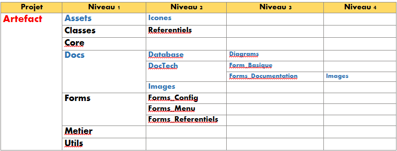
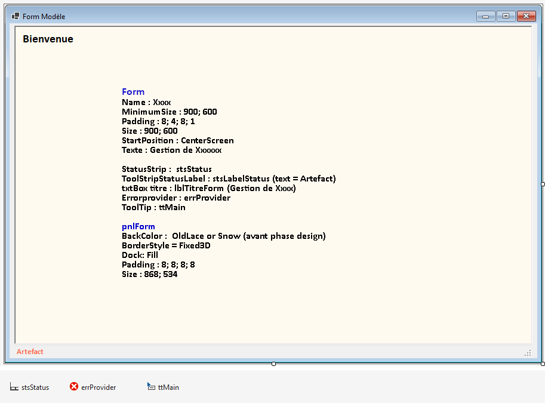

# 📚 Artefact
[TOC]

---

## 🎭 Pourquoi Artefact ?

Artefact est né d'une frustration concrète : après des années d'usage de Calibre et des milliers de livres gérés, certains besoins personnels restaient mal couverts.

Ce projet est à la fois un laboratoire technique, un projet plaisir et une bibliothèque de cœur. L'objectif est de construire une application robuste, élégante et évolutive, qui reste fidèle à ma façon de lire, classer et explorer mes livres.

## 🧩 Description

**Artefact** est une application Windows Forms développée en **VB.NET (.NET 8 LTS)** destinée à la gestion avancée d’une bibliothèque personnelle de livres numériques, implémentant des fonctionnalités de normalisation, d'enrichissement et de recommandation.

Le projet est une **reconstruction volontaire et maîtrisée** d’Artefactothèque, avec un objectif clair : simplifier, normaliser, structurer proprement et documenter dès le départ.

`Artefact` est un outil développé pour gérer une bibliothèque personnelle enrichie avec importation depuis **Calibre**, et d'autres sources de e-books, avec un stockage dans **MariaDB**, et gestion via une interface **VB.NET (WinForms)**, avec plus tard une version pour le Web.

L'IA est fortement impliquée pour enrichir les fiches de livres, proposer des recommandations, des nouveautés, les dates de sortie, proposer des news et automatiser certaines tâches de gestion.

Icône Artefact : 

## 🎯 Objectifs

- Concevoir une **base de données propre, cohérente et extensible**

  Séparer strictement :

  - les données validées
  - les données en cours de normalisation

  Éliminer les dérives structurelles héritées du POC

  Poser une architecture saine pour :

  - import Calibre
  - enrichissement externe
  - intégration IA future

  Documenter chaque décision structurante

## 🤖 Vision IA

L'IA est prévue comme un moteur d'enrichissement progressif : aide au résumé, détection d'incohérences, suggestions de métadonnées, recommandations contextualisées et automatisation de certaines tâches répétitives.

L'objectif n'est pas de remplacer le jugement humain, mais de gagner du temps sur les étapes à faible valeur et de garder l'énergie pour la curation.

## 🧠 Philosophie générale

Artefact repose sur :

- séparation stricte validation / import
- aucune donnée floue dans `livres`
- intégrité référentielle forte
- extensibilité maîtrisée
- documentation continue

---

## 🛠️ Environnement technique

### 💻 Application

- **Visual Studio Community 2026**
- Version 18.6.1 (05/26)
- VB.NET
- .NET 8 LTS
- Windows Forms

### 🗄️ Base de données

######  MariaDB 12.1.2 (09/04/26)
- Charset : `utf8mb4`
- Collation : `utf8mb4_uca1400_ai_ci`
- Nom base de données :  `Artefact`
- Outil : `HeidiSQL 12.17` (21/05/26) 
	- pour la gestion de la base de données MariaDB, l'exécution des requêtes SQL, la visualisation des données et la gestion des schémas.
- Outil : `DBeaver 26.0.5` (18/05/26)
	- pour la gestion de la base de données MariaDB, l'exécution des requêtes SQL, la visualisation des données, la gestion des schémas et les diagrammes.

###  ⚒️ Outils divers

- `Typora by Appmakes.io 1.13.6` (21/05/26)
  - Fichiers de documentation Markdown

### 🏚️ Versioning et sauvegarde

###### GitHub

- pour le contrôle de version et la collaboration
- https://github.com/AngeljoNG/Artefact (Private) (Mise à jour en continu)
- https://github.com/Les-Artefacts-de-Manou/Artefact (Public) (Dernière MàJ : 2026-05-22)

- Les Artefacts de Manou - AngeljoNG 

###    Calibre 9.8 (01/05/26) (Kovid Goyal) 

Fichier `Metadata.db` de Calibre, utilisé pour l'importation des livres qui ont déja été insérés antérieurement dans l'application Calibre. Ce fichier est copié sous le nom de `myMetadata.db` dans le dossier `MDCalibre` pour une utilisation locale.
Calibre est un logiciel de gestion de bibliothèque d'e-books, et le fichier `Metadata.db` contient les métadonnées des livres (https://calibre-ebook.com/fr). 
la copie du fichier se fait avec 2 fichiers .bat, pour l'instant manuellement, mais qui seront automatisés dans l'application.

- **Copie du fichier Metadata.db** : 
  - `CopyMetadata.bat` : copie le fichier Metadata.db de Calibre vers le dossier `MDCalibre` sous le nom `metadata_%curdate%.db` et nettoie les anciens fichiers (Voir Paths utilisés dans Artefact, ci-dessous)
  - `ReplaceMyMetadata.bat` : `metadata_%curdate%.db` renommé en `myMetadata.db`
- **DBBrowser for SQLLite** : V. 3.13.1  - utilisé pour visualiser le fichier `myMetadata.db` de Calibre. Il permet d'explorer les tables, afin de faciliter l'importation des données déjà implémentées dans Calibre, données en SQLite.

### 📂 Packages et bibliothèques

#### ✌️ MySqlConnector 2.5.0 (12-11-25)
- Par Bradley Grainger - https://mysqlconnector.net/
- Pour la connexion à MariaDB 
- MySqlConnector is a C# ADO.NET driver for MySQL, MariaDB, Amazon Aurora, Azure Database for MySQL and other MySQL-compatible databases.

---

## Connexion à la base de données

Artefact utilise le package **MySqlConnector** pour la connexion MariaDB sous .NET 8.

### Philosophie :

- Point d’accès unique : `DatabaseManager`
- Aucune connexion ouverte manuellement ailleurs
- Utilisation systématique du bloc `Using`
- Pooling ADO.NET activé

---

## 🏚️ Architecture Solution

  

###  	1. Forms

   #####         📂 Forms_Menu 
*Contient le menu principal et la navigation vers les différentes fonctionnalités de l’application.* 

- `home` : Menu principal avec accès à toutes les fonctionnalités. Form d'ouverture par défaut.

#####        📂 Forms_Config 
*Contient les formulaires de configuration et de paramétrage de l’application.*

- `GestionConnexionMariaDb` : Formulaire de gestion de configuration de la connexion à la base de données, avec test de connexion intégré et sauvegarde des paramètres locaux chiffrés.

#####       📂 Forms_Referentiels
*Contient les formulaires de gestion des référentiels de l’application, tels que les langues, les auteurs, les pays, etc.*

- `GestionLangues` :  Formulaire de gestion du référentiel des langues, avec consultation, modification, validation et annulation.
- `GestionPays` : Formulaire de gestion de référentiel des pays, avec consultation, modification, validation et annulation.
- `GestionRefEnum` : Formulaire de gestion  des énumération des référentiels, avec consultation, modification, validation et annulation.
- `GestionContacts` : Formulaire de gestion des contacts (envoi de livres), avec consultation, modification, validation et annulation.
- `GestionEditeurs` : Formulaire de gestion des éditeurs, avec consultation, modification, validation et annulation.
- `GestionFormatFile` : Formulaire de gestion des formats de fichiers, avec consultation, modification, validation et annulation.
- `GestionImpression` : Formulaire de gestion des impressions, avec consultation, modification, validation et annulation.
- `GestionRecommandations` : Formulaire de gestion des recommandations, avec consultation, modification, validation et annulation.
- `GestionPrixLit` : Formulaire de gestion des prix littéraires, avec consultation, modification, validation et annulation.

### 	2. Classes
#####         📂 Core 
*Central de l’application, contenant les classes de base et les utilitaires.*

- `DatabaseManager` : Gestion de la connexion à la base de données, exécution des requêtes, gestion des transactions.
- `LocalDBConfig` : Gestion de la configuration locale de la base de données, lecture/écriture du fichier JSON, chiffrement/déchiffrement DPAPI.

#####         📂 Classes

###### 📂Referentiels
*Contient les classes métier représentant les différentes entités de référentiels de l’application, telles que les langues, les auteurs, les pays, etc.*

- `Langue` : Classe métier représentant une langue. Contient les propriétés de la langue.
- `Pays` : Classe métier représentant un pays. Contient les propriétés du pays.
- `RefEnum` : Enumération des différents types de référentiels (Langues, Pays, Auteurs, etc.) pour faciliter la gestion générique des référentiels dans les modules métier.
- `RefEnumTyp` :  Enumération des types de données (String, Integer, Date, etc.) pour les champs des référentiels, permettant une validation et une gestion générique des données dans les modules métier.
- `Contact` : Classe métier représentant un contact (pour l’envoi de livres), avec les propriétés du contact.
- `Editeur` : Classe métier représentant un éditeur, avec les propriétés de l’éditeur.
- `FormatFile` : Classe métier représentant un format de fichier, avec les propriétés du format de fichier.
- `Impression` : Classe métier représentant une impression, avec les propriétés de l’impression.
- `Recommandation` : Classe métier représentant une recommandation, avec les propriétés de la recommandation.
- `RefOrigineRecommandation` : Classe métier représentant l'origine d'une recommandation, avec les propriétés de l'origine de la recommandation.
- `PrixLit` : Classe métier représentant un prix littéraire, avec les propriétés du prix littéraire.
- `PrixLitCategorie` : Classe métier représentant une catégorie de prix littéraire, avec les propriétés de la catégorie de prix littéraire.
- `PrixLitAnnee` : Classe métier représentant une année de prix littéraire, avec les propriétés de l'année de prix littéraire.

### 	3. Modules
#####         📂 Core
*Central de l’application, contenant les classes de base et les utilitaires.*

-  `GestionLog` : Gestion des logs, avec différentes méthodes pour enregistrer les événements, erreurs et informations de débogage.
- `QueryModule` : Module de construction et d’exécution des requêtes SQL, avec des méthodes pour les opérations CRUD (Create, Read, Update, Delete) sur les différentes tables de la base de données.
- `ConfigLocalManager` : Gestion de la configuration locale, lecture/écriture du fichier JSON, chiffrement/déchiffrement DPAPI.
- `CryptoManagerDPAPI` : Gestion du chiffrement et déchiffrement des données sensibles via DPAPI.

#####         📂 Utils 
*Utilitaire pour les fonctions de base, comme la validation des données, les conversions, les formats de date, etc.*

- `UtilsForm` : Fonctions utilitaires pour les formulaires, comme la validation des champs, etc.
- `RichTextNotesHelper` : Helper central pour la gestion des notes enrichies, basé sur RichTextBox.

#####        📂 Metier
*Contient les modules métier pour la gestion des différentes fonctionnalités de l’application, telles que la gestion des référentiels, la gestion des livres, etc.*

- `GestionReferentiel` : Module métier pour la gestion des référentiels, avec des méthodes pour la consultation, la modification, la validation et l'annulation des données.

### 	4. Assets
#####        📂 Icons
- Icones utilisées dans l’application, organisées par thème et fonctionnalité.

### 	5. Doc
- Documentation en Markdown, organisée par thème et fonctionnalité, pour expliquer les décisions de conception, les processus métier, les règles de codage, etc.
#####        📂 Database
- Diagrammes de la base de données
- Backups de la base de données (sans données et avec données de test)
- Scripts SQL pour la création de la base de données, les tables, les séquences, les procédures stockées, etc.
- Script SQL pour la migration de la base de données, les modifications de schéma, etc.
- Documentation détaillée du modèle de données, des tables, des relations, etc.
#####        📂 DocTechs
   #####        📂 Form_Basique

  #####        📂 Forms_Documentation
- Documentation détaillée de chaque formulaire, avec les processus métier, les règles de gestion, les processus de validation, les messages utilisateur, etc.	: 
	- [`Documentation_technique_Forms_referentielles_Phases1et2.md`](Docs/DocTech/Forms_Documentation/Documentation_technique_Forms_referentielles_Phases1et2.md)

___

## 🚀 Démarrage & Connexion MariaDB

Artefact démarre toujours en vérifiant la connexion à MariaDB via une configuration locale sécurisée.

### 🔐 Configuration locale

- Fichier : `%APPDATA%\Artefact\artefact.local.json`
- Contient : Host, Port, Database, UserName, Options
- Mot de passe : chiffré via DPAPI (Base64)
- Le JSON est la **source de vérité au démarrage**

La base de données ne doit jamais être nécessaire pour établir la première connexion.

### 🏁 Flux de démarrage

1. `Home` s’ouvre en mode verrouillé.
2. Lecture du fichier JSON local.
3. Tentative de connexion MariaDB.
4. Si connexion OK → activation de la navigation.
5. Si échec → ouverture de `GestionConnexionMariaDb`.

L’interface reste verrouillée tant que la connexion n’est pas validée.

### 🧩 GestionConnexionMariaDb

Permet :

- Création ou modification des paramètres de connexion
- Test en temps réel
- Sauvegarde locale
- Chiffrement automatique du mot de passe
- Modification explicite du mot de passe uniquement sur demande

La fenêtre ne se ferme que si la connexion est validée.

###  🔐 Versionnement du Schéma Artefact

Artefact utilise un versionnement interne du schéma de base de données.

- Table concernée : `meta_schema`
- Champ clé : `schema_version`
- Vérification effectuée au démarrage de l'application

Ce mécanisme garantit :
- La cohérence entre l'application et la structure DB
- La détection immédiate des incompatibilités
- Une évolution maîtrisée du modèle de données

⚠ Cette version ne concerne pas MariaDB mais exclusivement le schéma Artefact.

Version actuelle : 

> ##### Private Const ExpectedSchemaVersion As Integer = 6
>
> ##### modification : 2026-03-20 16:45:07 

### 👤 Utilisateurs MariaDB

Deux comptes distincts sont utilisés :

- `root` → administration (DDL, gestion structure)
- `artefact_app` → exploitation applicative

Droits applicatifs :

- SELECT
- INSERT
- UPDATE
- DELETE
- EXECUTE
- SHOW VIEW

Aucun droit structurel (CREATE / ALTER / DROP).

### ⚠️ Remarques importantes

- Toujours utiliser `127.0.0.1` (et non `localhost`) pour forcer TCP.
- Éviter l’utilisation du compte `root` dans l’application.
- Le préfixe commun des mots de passe chiffrés DPAPI est normal.

---

## 🧾 Système de Logging Artefact

Artefact dispose d'un système de logging production-ready.

### Caractéristiques

- Fichier journalier : Artefact_YYYY-MM-DD.log
- Emplacement : %APPDATA%\Artefact\Logs
- Rotation automatique (7 jours)
- Thread-safe
- Masquage des secrets
- Header de session à chaque lancement

### Niveaux

- Rapide   : jalons majeurs
- Succinct : états et erreurs significatives
- Complet  : détails techniques (stack trace, inner exception)

Le logging est conçu pour être à la fois lisible et exploitable pour diagnostic.

---

## 🔐 Sécurité & Configuration

Artefact utilise DPAPI (DataProtectionScope.CurrentUser) pour protéger les mots de passe de connexion MariaDB.

### Principes

- Le mot de passe est stocké chiffré en Base64 dans artefact.local.json.
- Le déchiffrement est effectué uniquement au moment de la construction de la connection string.
- Ne déchiffre jamais le mot de passe pour affichage.
- Permet une visualisation temporaire via bouton "œil".
- N’affiche jamais le mot de passe dans les logs.
- En cas d’erreur de déchiffrement :
  - L’exception est remontée.
  - Un log détaillé est généré (sans fuite de secret).

### Architecture

- Une seule fonction centrale construit la connection string.
- Les chemins système utilisent une source unique (`GetArtefactFolderPath()`).
- Toute erreur IO est loggée et traçable.

La couche configuration + connexion est désormais stabilisée pour un usage production.

---

## Référentiels – Pattern Implémenté

Le référentiel `Langues` constitue le modèle de référence pour tous les futurs référentiels.

### Structure

- Classe métier dédiée (ex: `Langue`)
- Requêtes SQL centralisées dans `QueryModule`
- Exécution via `GestionReferentiel`
- UI dédiée par entité

### Workflow

- Consultation par défaut
- Modification via bouton explicite
- Annulation via snapshot interne
- Validation locale via `errProvider`
- Messages utilisateur via `StatusStrip`

### Design

- TableLayoutPanel privilégié pour stabilité du Designer.
- SplitContainer exclu (bug)
- Tous les référentiels utilisent désormais :
- Une structure Form identique.
- Un style DataGridView centralisé.
- Une gestion des modes uniforme (Consultation / Nouveau / Modification).

### Conventions

- `code_xxx` généré automatiquement (jamais édité)
- ISO 639 (Langues) : minuscules.
- ISO 3166 (Pays) : majuscules.
- code_xxx généré automatiquement et jamais édité.

### Référentiels multi-tables

Le projet inclut des référentiels simples (1 table) et des référentiels composés (plusieurs tables).

Exemples :

Référentiels simples :
- langues
- pays

Référentiel composé :
- ref_enum
  - ref_enum_type
  - ref_enum

Ce type de référentiel permet de gérer :

- catégories de valeurs
- valeurs associées
- paramétrage extensible

Il constitue un système d'énumérations dynamiques utilisé dans plusieurs tables métier.

Ce pattern doit être reproduit pour :
Auteurs, Pays, Tags, Editeurs, Series, etc.

### Gestion des dépendances référentielles (suppression)

Les référentiels (langues, pays, ref_enum, etc.) peuvent être utilisés par de nombreuses tables métier.

Pour éviter les erreurs de suppression liées aux contraintes SQL :

- l’application effectue un contrôle préalable des dépendances
- les suppressions sont adaptées selon le type de contrainte (`RESTRICT` ou `SET NULL`)

Cela garantit :

- des messages utilisateurs compréhensibles
- l’absence d’erreurs SQL exposées directement à l’interface
- une cohérence globale du comportement des référentiels.

⚠️ Important :

Si une nouvelle table est ajoutée et référence un référentiel existant (ex. `ref_enum`), il est impératif de mettre à jour le système de contrôle de suppression afin d’intégrer cette nouvelle dépendance.

---

## Système de recommandations
Artefact intègre un système permettant de documenter les **sources de recommandation de livres**.

Une recommandation représente une suggestion provenant d'une source externe ou humaine :

- réseaux sociaux
- blogs
- libraires
- amis
- podcasts
- etc.

Chaque recommandation est stockée dans la table :
`recommandations`
et peut être associée :

- à un livre normalisé (`livres`)
- à un livre en phase de capture (`livres_staging`)

Cette association est réalisée via deux tables de liaison :
`livres_recommandations`
`livres_staging_recommandations`

Le système permet ainsi :

- de conserver l'historique des recommandations
- de documenter les sources
- d'analyser ultérieurement l'influence des différentes sources de découverte de livres.

Ce mécanisme prépare également l'intégration future de processus automatisés de veille sur des sites comme Babelio ou Booknode.

---

## 📝 Gestion des notes enrichies

Artefact utilise un système standardisé pour la gestion des notes enrichies basé sur RichTextBox.

### Principe

Chaque champ de notes est stocké dans deux colonnes :

- `_rtf` : contenu formaté (affichage UI)
- `_txt` : texte brut (recherche SQL)

### Objectifs

- conserver la mise en forme utilisateur
- garantir des recherches fiables et performantes
- permettre une réutilisation uniforme du système

### Implémentation

- Helper central : `RichTextNotesHelper`
- Toolbar standard :
  - Gras
  - Italique
  - Souligné
  - Liste
  - Tabulation

### Règles importantes

- Le RTF n'est jamais utilisé pour les recherches
- Le texte brut n'est jamais utilisé pour l'affichage riche
- Toute manipulation passe par le helper

Ce choix permet d'offrir un système de notes enrichies tout en conservant des performances de recherche simples côté base de données.

---

## ⚠️ Attention - Valeurs UI vs Métier

Les contrôles UI (ex: ComboBox avec "Toutes origines") ne doivent jamais injecter de valeurs non métier en base.

Toute valeur utilisée en base doit être valide et cohérente avec les contraintes relationnelles.

---

## 📂 Paths utilisés dans Artefact

#### 🧠 1. **Dossiers de configuration**

- Le niveau 2 est le dossier de configuration générale de l'application, créé dans le niveau 1 au départ de l'application

| Niveau 1      | Niveau 2       | Niveau 3 | Key       | Explication                                                  | Création                                                     |
| ------------- | -------------- | -------- | --------- | ------------------------------------------------------------ | ------------------------------------------------------------ |
| **%APPDATA%** | ***Artefact*** |          | Path_Conn | *Dossier de configuration générale de l'application, contenant les fichiers JSON locaux et autres paramètres spécifiques à l'utilisateur.* | Au 1er démarrage de l'application, lors du test de connexion |
|               |                | Logs     | Path_Logs | Dossier de configuration générale de l'application, contenant les fichiers de logs, sous forme de .txt | Au 1er démarrage de l'application, lors du test de connexion |

#### 🧠 2. **Dossiers Datas**

- Ces dossiers sont destinés à stocker les données et fichiers nécessaires au fonctionnement de l'application. Ils peuvent contenir des fichiers de configuration, des bases de données, des logs, etc.
- Les paths sont contenus dans la table `parametre` ou dans le fichier `config.ini`
- Ils seront créés au fur et à mesure de leur utilisation mais l'emplacement général Niveau 1 et 2 sera créé à la 1ère utilisation de l'application. 
- Une vérification de leur emplacement sera toujours faite avant chaque utilisation.

| Niveau 1     | Niveau 2      | Niveau 3     | Key                    | Explication                                                  | Création |
| :----------- | :------------ | :----------- | :--------------------- | :----------------------------------------------------------- | -------- |
| **Artefact** |               |              | Path_General           | *Path général permettant d'accéder à tous les autres paths*  |          |
|              | **Datas**     |              | Path_Data              | *Path permettant d'accéder au stockage des data fichiers physiques  de Artefactotheque* |          |
|              |               | AutPhoto     | Path_Data_AutPhoto     | *Path stockage photos des auteurs*                           |          |
|              |               | Fichelecture | Path_Data_FicheLecture | *Path stockage fiches de lecture*                            |          |
|              |               | LivStaging   | Path_Data_LivStaging   | *Path stockage livres non normalisés*                        |          |
|              |               | LivBiblio    | Path_Data_LivBiblio    | *Path stockage livres normalisés- Bibliothèque principale*   |          |
|              |               | LivWaiting   | Path_Data_LivWaiting   | *Path stockage d'attente*                                    |          |
|              |               | Statistiques | Path_Data_Stat         | *Path stockage fichiers Statistiques*                        |          |
|              | **DBCalibre** |              | Path_DBCalibre         | *Path permettant d'accéder à la base de données de Calibre*  |          |

---

## 📘 Documentation liée

- `CHANGELOG` : [`CHANGELOG.md`](Docs/CHANGELOG.md) - Changelog des modifications, ajouts, suppressions et évolutions du projet
- `Rules` : [`Rules.md`](Docs/Rules.md) - Règles de codage, bonnes pratiques et conventions à suivre
- `Processus Artefact` : [`Process_Artefact.md`](Docs/Process_Artefact.md) - Description des processus métier, des flux de données et des règles de gestion
- `TODO` : [`TODO.md`](Docs/TODO.md) - Liste des tâches à réaliser et des améliorations prévues
- `Backup Database Artefact sans données` : [`backup_NoData_artefact.sql`](Docs/Database/backup_NoData_artefact.sql) - Backup de la base de données MariaDB sans données, pour initialiser le projet
- `Backup Database Artefact avec données` : [`backup_WithData_artefact.sql`](Docs/Database/backup_WithData_artefact.sql) -  Pour les données de base (Tests)
- `Diagrammes DB` : [`artefact_schema_erdiagram.mmd`](Docs/Database/artefact_schema_erdiagram.mmd) - Diagrammes de la base de données
- `Diagramme image` : [`artefact_key.png`](Docs/Database/artefact_key.png) - Diagramme de la base de données au format image
- `Modèle database`  : [`ModeleDB.md`](Docs/Database/ModeleDB.md) - Description détaillée du modèle de données, des tables, des relations, etc.
- `Documentation Technique : Forms référentielles Phase 1 et 2`  : [`Documentation_technique_Forms_referentielles_Phases1et2.md`](Docs/DocTech/Forms_Documentation/Documentation_technique_Forms_referentielles_Phases1et2.md) - Documentation technique des forms référentielles, phases 1 et 2
- `Vision produit` : [`VISION.md`](Docs/VISION.md) - Vision, intention produit et ADN du projet
- `Guide de reprise` : [`REPRISE.md`](Docs/REPRISE.md) - Démarrage rapide pour reprendre le projet proprement
- `Glossaire` : [`GLOSSAIRE.md`](Docs/GLOSSAIRE.md) - Définitions des termes métier et techniques du projet
- `Tableaux de colonnes DB` : [`Tableaux_Colonnes.md`](Docs/Database/Tableaux_Colonnes.md) - Vue consolidée des champs/types/contraintes table par table

---

---
>
> **Contact** : ***Joëlle (Manou)  - Les Artefacts de Manou***
>
> Projet personnel, expérimental, réalisé pour le fun, le test et l'étude de connaissances techniques.
> mailto: `joelle@nguyen.eu`
>
> - GitHub privé : Artefact    https://github.com/AngeljoNG/Artefact
> - GitHub public : Artefact  https://github.com/Les-Artefacts-de-Manou/Artefact
>
>
---

